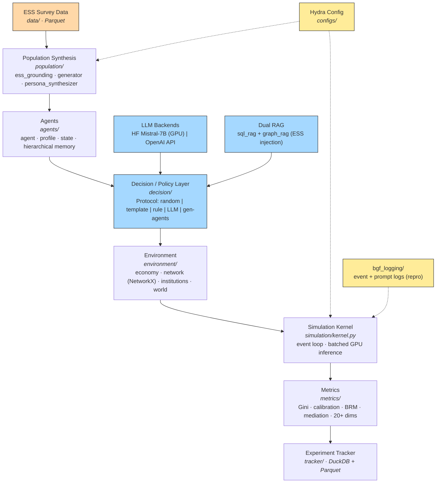

# BGF Architecture

Visual: open `docs/architecture.excalidraw` at [excalidraw.com](https://excalidraw.com)
(File → Open) or via the Excalidraw VS Code extension. Mermaid fallback below.

**Data flow:** ESS empirical distributions ground synthetic agent populations →
agents make decisions through a pluggable policy `Protocol` (LLM backends + dual
RAG inject context) → the economic environment resolves actions → the kernel
drives the event loop with batched inference → metrics evaluate realism → every
run is registered in the DuckDB tracker. Hydra config and `bgf_logging` are
cross-cutting (snapshots + full reproducibility).
