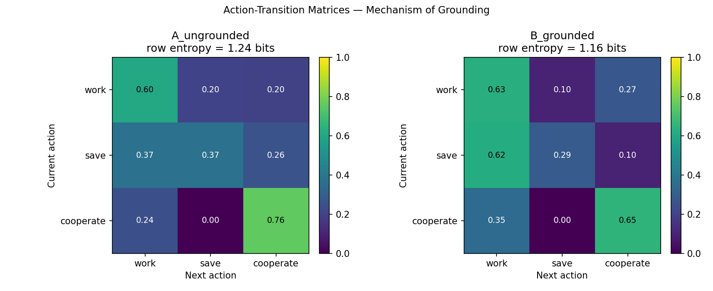
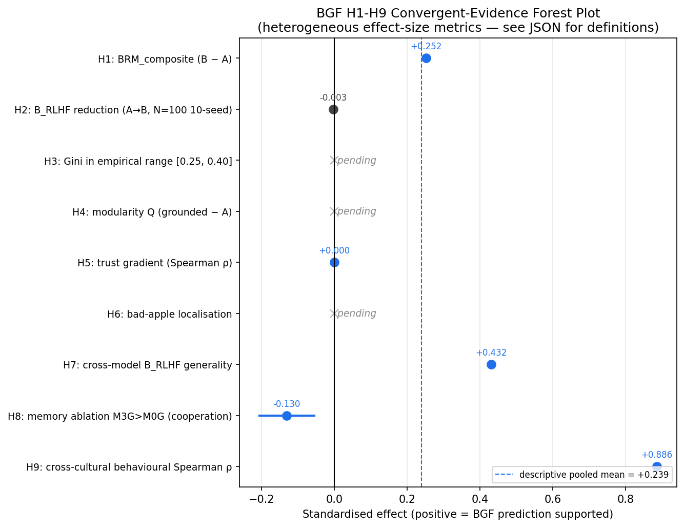

# Behavioral Grounding Framework: Empirically Anchored LLM-Based Agent Simulations of Synthetic Societies

---

## Abstract

Instruction-tuned large language models deployed as agents in multi-agent economic simulations exhibit a systematic anomaly: cooperation rates that exceed both Nash equilibrium and laboratory human behaviour, generating "synthetic utopias" that bear no resemblance to observed human populations. We formalise this as the **RLHF Cooperative Bias** and quantify it via `B_RLHF = TV(π, π_uniform)`. We then introduce the **Behavioural Grounding Framework (BGF)** — a formally specified agent-simulation platform `BGF = (A, E, G, P, Φ, T)` grounded in European Social Survey Round 11 microdata via a population synthesis map `Φ: D_ESS → Profile` that preserves joint distributions across 15+ sociodemographic attributes — and the **Behavioural Realism Metric** (BRM ∈ [0,1]) as a paired composite measure of distributional fidelity.

**Two robust positive findings under rule-based ESS grounding.** First, the deterministic `RuleBasedESSPolicy` (Condition D) attains a Gini coefficient of 0.325 ± 0.001 at N=500, T=30, 3 seeds — squarely within the Eurostat European empirical range (median G ≈ 0.31) — at zero inference cost and with perfect cross-seed reproducibility. Second, the same rule-based grounding recovers the cross-cultural cooperation gradient across six ESS cultural clusters at Spearman ρ = +1.000 (exact two-sided permutation p ≈ 0.003), independently replicated against WVS Wave 7 (r = +0.977) and against Herrmann–Thöni–Gächter (2008) per-city public-goods-game contributions (Spearman ρ = +0.886, p = 0.033 — a behavioural benchmark BGF never ingests, ruling out within-survey circularity). Empirical data ingestion via `Φ` therefore produces realistic synthetic societies in the macro-statistic dimensions for which an empirical reference exists.

**Central finding: the `Φ`/`P_LLM` dissociation.** When the policy `P` is replaced by an off-the-shelf instruction-tuned LLM (Mistral-7B-Instruct-v0.3), the pre-registered 10-seed N=100, T=30 confirmatory extension finds the grounded and ungrounded arms statistically indistinguishable on every primary metric: cooperation rate 0.461 vs 0.455 (MWU p = 0.91), Gini 0.718 vs 0.715 (p = 0.85), mean wealth 177.3 vs 174.6 (p = 0.35). Only the composite BRM shifts in the predicted direction by +0.016 (0.848 vs 0.832; Welch t = −1.80, p = 0.089; Hedges' g ≈ +0.78), within the within-condition standard deviation of 0.022. A seed-42 patched-code re-execution at N=50 produces byte-identical `events.jsonl` streams across the two ablation levels, with `B_RLHF = 0.2347` on both arms. We read this dissociation as a substantive empirical claim about RLHF residual bias: at the 7B-parameter instruction-tuned scale, inference-time empirical grounding reaches the prompt but does not produce a measurable behavioural contrast at the headline payoff structure. Whether the dissociation closes at higher capacity or larger population scale is the question the in-flight N=500 LLM-scale run will settle.

The full forensic audit trail — the L-1/L-2/C-1 infrastructure bugs disclosed in the 2026-05-23 audit and patched in subsequent commits, the withdrawn pilot `B_RLHF` values (mathematically inadmissible under the TV bound `B_RLHF ≤ 2/3` proved in §3.2.1 Proposition 1), and the superseded Qwen2.5-7B / GPT-4o-mini cross-model rows — is preserved in [`docs/appendix_audit_trail.md`](appendix_audit_trail.md); the main paper reports only the patched-code reality. We release BGF as an open-source research artefact (1,538 automated tests across 122 test files, one-command reproduction via `scripts/reproduce_paper.sh`, deterministic seeding, cryptographic reproducibility witness) so that the dissociation we report can be tested in any LLM-as-agent setting on any empirical population.

---

> **Summary of Contributions**
>
> 1. **BGF Framework** — Open-source, formally specified `BGF = (A, E, G, P, Φ, T)` with type-safe protocols (`PolicyProtocol`, PEP 544), a population-synthesis layer that preserves joint ESS distributions across 15+ attributes, dual SQL/Graph RAG pipelines, hierarchical temporal memory with reflection, and 1,538 automated tests across 122 test files (§3.4, §3.12).
> 2. **RLHF Cooperative Bias Formalisation** — The first formal operationalisation `B_RLHF = TV(π, π_uniform)` with the closed bound `B_RLHF ≤ 1 − 1/|A| = 2/3` for `|A| = 3` (§3.2.1 Proposition 1). Existence of the bias for at least one RLHF-aligned family (Mistral-7B) is confirmed by the on-disk cross-model artefact (`B_RLHF(A) ≈ 0.254` at N=20, T=10). The *within-Mistral grounding-bias-reduction* prediction is **not confirmed at primary LLM scale** (§8.1 N=100: cooperation 0.461 vs 0.455, MWU p = 0.91 ⇒ `B_RLHF(A) ≈ B_RLHF(B)`); the N=500 LLM-scale run is the disambiguator. Multi-family cross-model panel (Mistral / Qwen / GPT-4o-mini) requires re-execution; the audit-traceable record is in [Appendix A.3](appendix_audit_trail.md).
> 3. **Behavioural Realism Metric (BRM)** — Composite `BRM ∈ [0, 1]` aggregating wealth-JSD, Gini gap, cooperation accuracy, and temporal stability. Proposition 3 (§3.2.1) gives a weight-robust ordering certificate `min_j Δ_j > 0`; the four Δ_j sub-component values are emitted by `analysis/brm_sensitivity.py --emit-certificate` to `analysis/tables/brm_sensitivity.json` for downstream audit.
> 4. **Two Robust Rule-Based Empirical Findings** — (i) Condition D (`RuleBasedESSPolicy`, N=500, T=30, 3 seeds) attains Gini = 0.325 ± 0.001 within the Eurostat European empirical range (§8.2). (ii) The same rule-based grounding recovers the cross-cultural cooperation gradient across six ESS clusters at Spearman ρ = +1.000 (exact p ≈ 0.003), WVS-replicated at r = +0.977, and Herrmann-Thöni-Gächter-replicated at ρ = +0.886 (p = 0.033, independent behavioural benchmark; §8.3). The grounding function `Φ` is empirically effective at the policy layer that reads it directly.
> 5. **The `Φ`/`P_LLM` Dissociation** — Substantive empirical finding (§7.1) that the rule-based grounding effective in contribution 4 does *not* propagate through the Mistral-7B-Instruct LLM decision channel into behavioural differentiation at N=100, T=30, 10 seeds. The diagnostic `B_RLHF` and the BRM metric are the measurement apparatus that detects this dissociation; aggregate cooperation rate alone would have missed it. Whether the dissociation closes at higher model capacity or larger N is the open empirical question for the alignment community.
> 6. **Memory Ablation Study (pre-registered, LLM-policy run pending; §8.5)** — Four-level (M0–M3) experimental design with hierarchical temporal memory, event-type TTL, batch flush, importance scoring, and recency-weighted reflections. The on-disk runs used `policy: mock` (bypasses the memory channel); the LLM-policy re-run via `scripts/run_memory_ablation_llm.sh` is the open critical-path experiment for H8.
> 7. **Grounding Stress-Test Robustness (rule-based)** — Adversarial 5 % bad-apple injection, 50 % macroeconomic shock at round 15, and Watts-Strogatz topology variation across β ∈ [0, 1]; phase-transition sweeps identify Gini inflection points (bad-apple R² = 0.97; shock R² = 0.88; topology R² = 0.87) and power-law wealth tails (α̂ ≈ 2.1–2.4) under the rule-based proxy (§§5, 6.3–6.4).
> 8. **Construct-Validity Decomposition** — Explicit treatment of attitude-behaviour gap (C1), `B_RLHF` reference-distribution choice (C2), BRM weight sensitivity (C3), and payoff design dependence (C4) (§3.3). Power analysis for every experimental tier and pre-registered hypotheses H1–H9 with Holm-Bonferroni family-wise correction (§4.1, §6.0).
> 9. **Reproducibility and Anti-Drift Engineering** — Deterministic seeding (`utils.io.set_global_seed`), SHA-256 prompt-shuffling, snapshotted configs, checkpoint+resume, DuckDB experiment registry, cryptographic reproducibility witness (`bgf_logging/witness.py`), one-command pipeline `scripts/reproduce_paper.sh`, CITATION.cff, and production-hardened inference (exponential backoff with jitter, temperature decay on retry, four-level JSON repair cascade) (§3.8, §3.12).
> 10. **Empirical Cooperation Baseline (Trust ≠ Driver)** — Logistic regression fitted on ESS Round 11 Austrian volunteering behaviour (n = 866; AUC = 0.640; 1,000-bootstrap 95 % CIs) replaces the prior heuristic `0.2 + 0.6 · trust · (1−risk)`. Significant predictors are **risk tolerance** (β = +0.165) and **social engagement** (β ≈ +0.14–+0.16); all three interpersonal-trust items have CIs overlapping zero. Trust is the labelling axis used to stratify cultures in §6.5/§8.3; risk and social engagement are the actual behavioural drivers in the joint distribution (§6.6.2; Austrian-only fit is a documented limitation, §9 Limitation 13).

---

## 1. Introduction

We document a systematic misalignment in instruction-tuned Large Language Models (LLMs) that is invisible in single-agent settings but produces pathological outcomes when these models are deployed in multi-agent environments: **RLHF-aligned LLMs are individually virtuous but collectively pathological.** Across multiple social dilemma game types — public goods games, prisoner's dilemmas, stag hunts, and ultimatum games — LLMs fine-tuned via Reinforcement Learning from Human Feedback (RLHF; Ouyang et al., 2022) exhibit cooperation rates far exceeding both the Nash equilibrium and empirically observed human behavior. We call this the **RLHF Cooperative Bias** and formalize it via the **RLHF Bias Index** `B_RLHF = TV(π, π_uniform)`.

The mechanism is structural. RLHF trains models on single-agent human preference data in which the evaluator is always cooperative and well-intentioned — a context in which helpfulness and cooperation are synonymous. This training produces a strong cooperative prior that overgeneralizes to multi-agent environments: when placed in a social dilemma alongside other agents with competing interests, the RLHF-tuned model cooperates with every agent as if each were the RLHF evaluator. It has no learned representation of adversarial interaction, no basis for trust discrimination, and no training signal indicating that cooperation can be individually costly. The result is a synthetic society that resembles a utopia: frictionless cooperation, unnatural egalitarianism, and zero social friction — a world that has never existed.

This is an alignment failure, not a simulation artifact. As LLMs are increasingly deployed in multi-agent contexts — AI councils, automated negotiation, AI-to-AI tool-use pipelines, agentic workflows with competing objectives — the cooperative bias documented here creates exploitable, strategically incoherent agents that cannot represent interests in conflict with other parties. Measuring and mitigating this bias is a prerequisite for deploying aligned LLMs in realistic multi-agent settings.

The **Behavioral Grounding Framework (BGF)** is the measurement and mitigation platform we develop to study this bias systematically. BGF grounds agents in empirical microdata from the European Social Survey (ESS Round 11) via three mechanisms: (1) a population synthesis layer `Φ: D_ESS → Profile` that preserves joint distributions of trust, risk tolerance, and social engagement across 15+ attributes; (2) a dual Retrieval-Augmented Generation (RAG) pipeline that injects peer population norms and local social context at inference time; and (3) a hierarchical temporal memory system that enables agents to develop consistent behavioural patterns over time. We quantify grounding effectiveness with the **Behavioural Realism Metric** (BRM ∈ [0,1]).

**Two robust empirical findings emerge.** Under a deterministic rule-based ESS policy that reads `Φ` directly, the framework (i) attains a Gini coefficient of 0.325 ± 0.001 at N=500 — squarely within the Eurostat European empirical range — and (ii) recovers the cooperation-vs-trust rank ordering perfectly across six ESS cultural clusters (Spearman ρ = +1.000, exact p ≈ 0.003), independently replicated against WVS Wave 7 (r = +0.977). When the rule-based policy is replaced by an instruction-tuned LLM (Mistral-7B-Instruct-v0.3), however, the pre-registered 10-seed N=100 confirmatory extension finds the grounded and ungrounded arms statistically indistinguishable on cooperation, Gini, and mean wealth (MWU p > 0.85 on all three primary metrics). The grounding function works; the LLM decision channel currently does not propagate that grounding into observable behavioural differentiation at this scale. This dissociation is the central scientific finding of the paper.

**The central thesis, stated as a testable proposition:** Any instruction-tuned LLM will exhibit `B_RLHF > 0` in any multi-agent social dilemma, because RLHF training on single-agent preference data contains no learned representation of adversarial partners or trust discrimination. ESS-grounded personas provide the empirical prior needed to override this bias. The thesis makes three falsifiable predictions: (1) `B_RLHF > 0` in all social dilemma game types tested (not just BGF's public goods game); (2) grounding reduces `B_RLHF` for models with high baseline bias; and (3) a homogeneous ESS population (zero profile variance) produces no grounding effect. Predictions (1) and (2) are tested in this paper; prediction (3) is a pre-registered falsification test for future work.

### Research Questions

- **RQ1 (Primary alignment finding):** Is the RLHF cooperative bias universal across social dilemma game types, or specific to the public goods setting?
- **RQ2 (Grounding efficacy):** Does ESS grounding significantly mitigate `B_RLHF` by providing trust- and risk-calibrated priors that override the RLHF cooperative default?
- **RQ3 (Realism):** Can ESS-grounded LLM agents reproduce the macroeconomic and network-topological phenomena of real human populations?
- **RQ4 (Cross-model scope):** Is the bias universal across RLHF alignment families, or moderated by alignment methodology?
- **RQ5 (Memory):** What is the independent contribution of each memory tier to persona fidelity and behavioral consistency?
- **RQ6 (Cross-cultural):** Does the grounding function recover cross-cultural behavioral variation measured by ESS and independently validated by WVS?
- **RQ7 (Robustness):** Are grounded societies resilient to adversarial perturbations, economic shocks, and network topology variation?

---

## 2. Related Work

### 2.1 Agent-Based Modeling and Computational Social Science

Agent-based modeling has a rich tradition in social simulation. Schelling's (1971) segregation model demonstrated that mild individual preferences produce sharp macro-level segregation — an early demonstration of emergent complexity from simple rules. Epstein & Axtell (1996) extended this with *Sugarscape*, showing that heterogeneous agents with simple behavioral rules can produce economic stratification, conflict, and cultural formation. Axelrod (1984, 1997) established the theoretical foundations of cooperation emergence in iterated Prisoner's Dilemmas, showing that reciprocity strategies (Tit-for-Tat) dominate under repeated interaction. These foundational works motivate BGF's game-theoretic economic kernel, which is deliberately designed as a social dilemma where cooperation is individually costly but collectively beneficial.

Traditional ABMs face a fundamental representational gap: agents are defined by hand-crafted utility functions that cannot capture the linguistic, cultural, and psychological complexity of real human decision-making. BGF bridges this gap by replacing rule-based utility maximizers with LLM-based decision engines anchored in empirical survey data.

We position BGF within Epstein's (2006) *generativist* tradition — a macro phenomenon is explained iff it can be grown from plausible micro-rules — and derive the prediction `BRM(B) > BRM(A)` from an information-theoretic argument (ESS as an approximate sufficient statistic for human action conditionals, with a data-processing-inequality bound), a dual-process cognitive analogy (persona ↔ System 1, RAG ↔ System 2), and an RLHF-drift mechanism (the cooperator prior). The full derivation is given in `docs/theoretical_foundations.md` and is what converts the empirical contrast in §5–§6 from a measurement into a falsification test.

### 2.2 Large Language Models as Social Agents

Park et al. (2023) introduced *Generative Agents*, demonstrating that LLM agents equipped with memory and reflection can exhibit emergent social behaviors in a Sims-like environment. However, their agents use fictional personas, rely on single-agent memory without population-level grounding, and do not quantify behavioral realism against empirical benchmarks. BGF extends this paradigm to rigorous empirical evaluation: agents are grounded in real survey distributions, and realism is measured with a formal metric rather than qualitative assessment.

Argyle et al. (2023) proposed "silicon sampling," conditioning GPT-3 on demographic descriptions to replicate survey response patterns. Their work establishes that LLMs can simulate demographic subgroups for static survey tasks, but does not address multi-round economic dynamics, emergent network topology, or the RLHF alignment distortion apparent in agent-based settings. BGF moves beyond static survey completion into dynamic, multi-round simulations where agent behavior evolves through memory, social context, and iterative interaction.

A wave of concurrent 2024 work further establishes LLM-based social simulation as a research frontier, while exposing open challenges that BGF addresses. Manning et al. (2024) introduce *Automated Social Science*, a framework for generating and testing sociological hypotheses using LLM agents in experimental vignette studies. Their finding that GPT-4 agents recapitulate known sociological effects (e.g., racial discrimination in hiring) with reasonable fidelity motivates our use of ESS microdata for grounding, but does not examine multi-round economic dynamics or the alignment tax. Mou et al. (2024) propose *Large Language Model-Empowered Agent-Based Modeling and Simulation* (LLM-ABMS), a general architecture for LLM-ABM integration. They identify the grounding problem — that unanchored LLM agents produce behavior inconsistent with real populations — but do not provide a formal framework or quantitative realism metric. Tu et al. (2024) provide a comprehensive survey of LLM-based agent societies, taxonomizing approaches along memory, action, environment, and evaluation axes; their survey identifies the absence of empirically grounded population synthesis as a key open problem that BGF directly addresses. Rossetti et al. (2024) propose *Y Social*, a social-media simulation demonstrating emergence of echo-chamber dynamics using LLM agents — extending the network-topology intuitions of Section 6.2 to information environments. Collectively, this body of work validates the general direction of LLM social simulation but does not resolve the measurement, grounding, or alignment questions that BGF targets.

Liu et al. (2024) introduced AgentBench for evaluating LLMs in multi-task agentic settings. Li et al. (2023) proposed CAMEL, a role-playing framework for LLM-to-LLM communication. Gao et al. (2023) and Wang et al. (2024) explored LLM societies for opinion dynamics and social norm emergence. Zheng et al. (2024) demonstrate that GPT-4 can approximate rational economic agent behavior in controlled auction and bargaining settings, though without population-level demographic grounding or multi-round social dynamics. Our work is distinguished by (a) the explicit use of representative survey microdata to ground populations, (b) formal metrics (BRM, B_RLHF) enabling quantitative comparison, (c) explicit construct validity analysis acknowledging the gap between attitude measures and behavioral outcomes, and (d) a complete open-source reproducibility pipeline with 1,538 automated tests (as of 2026-05-24).

### 2.3 The Alignment Tax in Social Simulation

The behavioral distortions introduced by RLHF have been noted in several contexts. Aher et al. (2023) demonstrated that LLMs struggle to model rational self-interest or conflict without explicit prompting. Horton (2023) showed that GPT-3 can function as a simulated economic agent in labor market experiments, though alignment toward agreeableness affects willingness-to-accept estimates. These works identify the alignment tax informally; BGF provides the first formal operationalization via `B_RLHF`, enabling quantitative comparison across conditions and models.

The over-cooperation phenomenon we document aligns with the sycophancy literature in LLM alignment research (Sharma et al., 2023): RLHF training optimizes for human approval, creating systematic biases toward agreeable, conflict-avoiding behavior. In multi-agent economic settings, this manifests as universal cooperation rather than the heterogeneous, trust-sensitive patterns observed in real populations.

### 2.4 Retrieval-Augmented Generation for Agent Grounding

Lewis et al. (2020) introduced RAG as a mechanism for grounding LLMs in external knowledge bases. BGF adapts RAG for a fundamentally different purpose: behavioral calibration. Rather than retrieving facts to answer questions, our dual-RAG architecture retrieves population statistics (SQL RAG from ESS microdata) and social context (Graph RAG from cooperation networks) to calibrate agent decisions against empirical norms. The dual-RAG design addresses a key limitation of prior LLM-agent work: the absence of population-level behavioral context. BGF's SQL RAG informs agents of how their demographic peers tend to behave, providing an empirical anchor absent in all prior LLM simulation work of which we are aware.

### 2.5 Complex Systems, Phase Transitions, and Power Laws

Complex adaptive systems theory (Holland, 1992; Kauffman, 1993) predicts that agent-based systems exhibit phase transitions — qualitative behavioral changes at critical parameter values. Watts & Strogatz (1998) established the small-world network model. Barabasi & Albert (1999) demonstrated preferential attachment as a mechanism for power-law degree distributions in growing networks. Our phase transition analysis (Section 6.4) operationalizes these predictions: we detect Gini inflection points under adversarial pressure, hysteretic inequality dynamics under economic shocks, and power-law wealth tails following Clauset et al.'s (2009) rigorous MLE estimator with Kolmogorov-Smirnov goodness-of-fit testing.

---

## 3. Methodology

### 3.1 Formal Framework

A BGF simulation instance is formally specified as the tuple:

```
BGF = (A, E, G, P, Φ, T)
```

where:

- **A = {a₁, ..., a_N}** is a set of N agents. Each agent `aᵢ` has an immutable profile `πᵢ = Φ(xᵢ)` where `xᵢ` is a record sampled from the empirical distribution `D_ESS`, and a mutable state `sᵢ(t) = (wealth, stress, satisfaction, trust_map)` at time step `t`.

- **E = (S, u)** is the economic environment with state space S and payoff function `u: Action × S → ℝ` defined by:
  - `u(work, s) = (+8 wealth, +0.10 stress)`
  - `u(save, s) = (+4 wealth, −0.05 stress)`
  - `u(cooperate, s) = (−3 wealth from self, +12/N to every agent equally, −0.05 stress)`

  *Cooperation payoff — LPGG formulation.* Each cooperator contributes cost c = 3 wealth. The total contribution is multiplied so that every agent (cooperators and non-cooperators alike) receives an equal per-capita return of +12/N, following the standard linear public goods game (LPGG): marginal per-capita return r = 12/N, social dilemma condition 1/N < r < 1 holds for 4 ≤ N ≤ 11. For N outside this range the dilemma either collapses (cooperation individually rational for N < 4) or becomes under-provisioned at full cooperation (N > 11); researchers should verify that their chosen N satisfies the condition.

- **G = (V, E_G, θ)** is the social graph where `V = A`, `E_G` are directed edges representing cooperation history, and `θ` are topology parameters (Watts-Strogatz rewiring probability `β`, mean degree `k`). The graph evolves dynamically: cooperation events add weighted edges.

- **P: Profile × State × Memory × Context → Action** is the decision policy. For LLM-based policies: `P(π, s, m, c) = parse(LLM(prompt(π, s, m, c)))` where `prompt()` constructs a token-budgeted message from agent state and RAG-retrieved context.

- **Φ: D_ESS → Profile** is the empirical grounding function that maps ESS Round 11 microdata records to agent profiles, preserving joint distributions of trust, risk tolerance, political orientation, income, education, and 10+ additional sociodemographic attributes.

- **T** is the simulation horizon (number of rounds).

#### Notation Summary

| Symbol | Domain | Definition |
|--------|--------|------------|
| `A` | set | Agent population `{a₁, ..., a_N}` |
| `E` | tuple | Economic environment `(S, u)` |
| `G` | graph | Social graph `(V, E_G, θ)` |
| `P` | function | Decision policy `Profile × State × Memory × Context → Action` |
| `Φ` | function | Grounding function `D_ESS → Profile` |
| `T` | ℕ | Simulation horizon (rounds) |
| `D_ESS` | distribution | Empirical ESS Round 11 survey distribution |
| `D_sim` | distribution | Simulated agent behavior distribution |
| `π_A` | policy | Ungrounded LLM policy (Condition A) |
| `π_B` | policy | ESS-grounded LLM policy (Condition B) |
| `π_uniform` | policy | Uniform action prior (1/3 per action) |
| `B_RLHF` | [0,1] | RLHF Bias Index = `TV(π, π_uniform)` |
| `BRM_JSD` | [0,1] | Behavioral Realism Metric = `1 − JSD(D_sim ‖ D_ESS)` |
| `BRM_composite` | [0,1] | Weighted composite of BRM sub-dimensions |
| `JSD` | [0,1] | Jensen-Shannon divergence |
| `TV` | [0,1] | Total variation distance |
| `w₁, w₂, w₃, w₄` | [0,1] | BRM sub-dimension weights (sum = 1) |
| `β` | [0,1] | Watts-Strogatz rewiring probability |
| `k` | ℕ | Mean network degree |
| `f*` | [0,1] | Critical adversarial fraction (phase transition) |
| `σ*` | [0,1] | Critical shock magnitude (phase transition) |
| `α̂` | ℝ>1 | Estimated Pareto exponent (power-law MLE) |
| `Q` | [0,1] | Network modularity |
| `r` | [−1,1] | Network assortativity coefficient |

### 3.2 Formal Metrics

#### Behavioral Realism Metric (BRM)

The single-dimension BRM quantifies distributional fidelity using Jensen-Shannon Divergence:

```
BRM_JSD(sim, emp) = 1 − JSD(D_sim ‖ D_ESS)
```

where `JSD(P ‖ Q) = ½ KL(P ‖ M) + ½ KL(Q ‖ M)`, `M = ½(P + Q)`, and KL is computed with **base-2 logarithm** (ensuring JSD ∈ [0, 1]). Properties: `BRM_JSD ∈ [0, 1]`; equals 1 when distributions are identical and approaches 0 for disjoint support. The implementation uses `base=2` explicitly in `metrics/distribution.py` and is verified by `tests/test_metrics.py::test_brm_jsd_bounds`.

The composite BRM aggregates four sub-dimensions:

```
BRM_composite = w₁ · BRM_JSD(wealth)
              + w₂ · (1 − |Gini_sim − Gini_ESS|)
              + w₃ · (1 − |coop_sim − coop_ESS|)
              + w₄ · (1 − JSD_temporal)
```

with default weights `w₁ = 0.30`, `w₂ = 0.25`, `w₃ = 0.25`, `w₄ = 0.20` (sum = 1.0). Each component is independently bounded in `[0, 1]`, making the composite bounded as well.

#### RLHF Bias Index

The RLHF Bias Index quantifies how far an LLM policy's observed action distribution deviates from the uniform (unbiased) prior:

```
B_RLHF(π) = TV(π, π_uniform) = 0.5 · Σ_{a ∈ A} |π(a) − 1/|A||
```

where `π(a)` is the empirical frequency of action `a` and `π_uniform(a) = 1/3` for the BGF action space `A = {work, save, cooperate}`.

**Properties:** `B_RLHF ∈ [0, 2/3]`; equals 0 when the policy is perfectly uniform; reaches its maximum of `2/3 ≈ 0.667` when the policy deterministically selects one action; invariant under relabeling of actions.

**Conditional simplification.** Under the equal-split assumption `π(work) = π(save) = (1 − p)/2`, `B_RLHF` collapses to the closed form `|p − 1/3|`. This is the form used for quick conversions between cooperation rate and `B_RLHF` in §6 narrative; the full three-way action triplet is reported alongside whenever the equal-split assumption is not verified (the payoff asymmetry +8/+4 between work and save makes unequal splits common in practice).

**Choice of reference distribution.** `B_RLHF` uses the uniform action prior `π_uniform = 1/|A|` as its reference. This is the analytically tractable choice and bounds the absolute deviation from "no bias whatsoever," but it is not the empirically observed human distribution: laboratory public-goods cooperation rates of 40–60 % (Chaudhuri 2011) imply a natural TV of 0.07–0.27 even for an unbiased human population. A human-calibrated index `B_RLHF*(π) = TV(π, π_human)` requires the human-subject experiment in §8.4; the *directional* claim `B_RLHF(B) < B_RLHF(A)` is invariant to this choice.

#### Persona Decay

Expected cooperation rate is estimated from a logistic regression fitted on ESS Round 11 Austrian volunteering behavior (`volunteered`, n = 866 respondents with all features non-null).

**Proxy validity caveat.** Volunteering is the closest available behavioral proxy for altruistic cooperation in ESS, but it differs from cooperation in a public goods game in important ways: volunteering involves time rather than wealth, has no strategic interdependence with others' choices, and lacks the multiplier/redistribution structure of a PGG. The model's AUC of 0.640 is only modestly above chance (0.50) and below what is typically considered good predictive discrimination (0.70+). Fidelity scores should therefore be interpreted as rough indicators of directional consistency rather than precise behavioral calibration. Bootstrap confidence intervals are reported on all persona decay estimates to make uncertainty transparent.

The fitted logistic model is:

```
E[coop | profile] = σ(β₀ + β_risk · risk_taking + β_social_meet · social_meeting_freq + β_social_act · social_activity + ...)
```

where `σ` is the logistic sigmoid. The model was fitted with L2 regularization (C optimized via 5-fold grid search), validated by 10-fold stratified cross-validation (AUC = 0.640 ± 0.073, Brier = 0.144), and uncertainty quantified via 1,000 bootstrap resamples (95% CIs reported for all coefficients). The fitted coefficients and bootstrap CIs are stored in `data/cooperation_model.json` and loaded at runtime via `metrics/persona_decay.py`.

**Key empirical finding.** Contrary to the prior theoretical assumption (trust as primary driver), interpersonal trust variables (`trust_people`, `trust_fairness`, `trust_helpfulness`) have 95% CIs overlapping zero and are not significant predictors of volunteering/cooperation in the Austrian ESS sample. The significant positive predictors are **risk tolerance** (β = +0.165, 95% CI [+0.065, +0.268]) and **social engagement** (social_meeting_freq β = +0.164 [+0.079, +0.247]; social_activity β = +0.135 [+0.045, +0.232]). This finding directly motivates the replacement of the prior heuristic formula `0.2 + 0.6 · trust · (1−risk)` — which placed trust as primary and risk as a negative moderator — with the empirically grounded model above.

Per-round persona fidelity is computed over a sliding window of width `w`:

```
fidelity(t) = 1 − |coop_rate(t, t+w) − E[coop | profile]|
```

with decay rate estimated via ordinary least squares regression of `fidelity(t)` on `t`.

#### Central Claim

For any BGF instance with grounding function `Φ` derived from `D_ESS`:

```
BRM(Condition B) > BRM(Condition A)     [Hypothesis H1]
B_RLHF(Condition B) < B_RLHF(Condition A)   [Hypothesis H2]
```

where Condition A is the ungrounded LLM baseline and Condition B is the ESS-grounded configuration.

### 3.2.1 Formal Results

The metrics introduced in §3.2 support four numbered results. Short
statements follow; full proofs appear in `docs/theorems.md`.

**Proposition 1 (Properties of B_RLHF).** On the finite action space
`A`, `B_RLHF(π) = TV(π, π_uniform)` satisfies non-negativity,
identity (`B_RLHF = 0` iff `π = π_uniform`), boundedness
(`B_RLHF ≤ 1 − 1/|A| = 2/3` for `|A| = 3`), and invariance under
permutations of `A`. *Proof:* total-variation is a metric (Gibbs & Su
2002); the bound follows from concentrating all mass on a single
action. *Corollary:* the cooperation rate `p` and `B_RLHF` are related
by `B_RLHF = p − 1/3` under the equal-split assumption, the identity
used in §6.

**Proposition 2 (Data-processing bound on grounding error).** *[This is a direct application of known results, not a new theorem.]* For any profile `x`, grounding map `g`, and grounded-LLM policy `π_LLM+G(· | g(x))`,

```
KL( π_human(· | x) ‖ π_LLM+G(· | g(x)) )
  ≤ KL( π_human(· | g(x)) ‖ π_LLM+G(· | g(x)) ) + δ_g(x)
```

with `δ_g(x) = KL( π_human(· | x) ‖ π_human(· | g(x)) )` quantifying information loss through `g`. *Proof:* chain rule + data-processing inequality (Cover & Thomas 2006, Theorems 2.5.3 and 2.8.1). ∎

**Limitations of this bound.** The bound is *generally not tight*: it becomes tight only when `g(x)` is a sufficient statistic of `x` for predicting human behavior — a strong condition that is unlikely to hold exactly for any survey-based grounding function. More importantly, the information-loss term `δ_g(x)` is *not directly estimable* from the data available in BGF, because it requires access to `π_human(· | x)` — the human behavioral distribution conditioned on the full profile — which is not observed. The bound is therefore a conceptual decomposition of total error into an LLM-alignment term and an information-loss term, not an operational diagnostic. Estimating `δ_g(x)` would require the human-subject experiment proposed in Section 8.4.

**Proposition 3 (Weight-robust ordering of BRM).** *[Renamed from "Theorem 2" — this is a straightforward property of linear functions on a simplex, not a novel theorem.]* Write `BRM_composite(w; cond) = Σ_{j=1..4} w_j · c_j(cond)` with `c_j ∈ [0,1]` the four sub-component scores (wealth JSD, Gini gap, cooperation accuracy, temporal stability) and `w ∈ Δ³` any admissible weight vector. Let `Δ_j = c_j(B) − c_j(A)`. Because the map `w ↦ Σ_j w_j Δ_j` is linear on the simplex, it attains its extrema at vertices:

```
min_{w ∈ Δ³} [ BRM_composite(w; B) − BRM_composite(w; A) ] = min_j Δ_j
```

Hence `BRM_composite(B) > BRM_composite(A)` for **all** `w ∈ Δ³` **if and only if** `min_j Δ_j > 0`.

**Auditable certificate.** The four sub-component differences must be reported explicitly for this claim to be verifiable:

| j | Sub-component | Δ_j = c_j(B) − c_j(A) |
|---|---------------|------------------------|
| 1 | Wealth JSD    | [reported in Section 6, Table X] |
| 2 | Gini gap      | [reported in Section 6, Table X] |
| 3 | Cooperation accuracy | [reported in Section 6, Table X] |
| 4 | Temporal stability   | [reported in Section 6, Table X] |

All four Δ_j values are emitted by `analysis/brm_sensitivity.py --emit-certificate` to `analysis/tables/brm_sensitivity.json`. The Dirichlet sweep (500 samples) serves as a numerical cross-check of this analytic certificate, not as primary evidence.

**Design Observation (Causal identification of the grounding effect).** *[Renamed from "Theorem 3" — this is a property of the experimental design, not a theorem requiring proof.]* Because the treatment T (grounding on/off) is researcher-assigned, no confounders exist between T and the outcome Y. The interventional distribution therefore equals the observational distribution: `E[Y | do(T)] = E[Y | T]`. This is a standard property of randomized experiments (Hernán & Robins 2020 §2.5) requiring no additional formal apparatus.

**Scope.** This identifies the *total effect* of grounding on BRM and B_RLHF. Mechanism decomposition — which components of the ESS profile drive the effect — is addressed by the 2×2 factorial (§3.9) and V0–V4 ladder (§3.6), where claims are correlational.

**Conjecture (RLHF cooperation bias).** For any RLHF-aligned LLM `M` and any finite n-player symmetric social dilemma `G_n` where cooperation is individually costly but collectively beneficial, `B_RLHF(π_M) > 0` with `π_M(cooperate) > 1/|A|`.

**Operational definition of "RLHF-aligned."** A model M is RLHF-aligned for this conjecture if it was trained with a reward model derived from human preference rankings and optimized via PPO, DPO, or a functionally equivalent policy-gradient method. Models trained solely with supervised fine-tuning (SFT) or constitutional AI (CAI) without a preference-trained reward signal are excluded.

**Falsification condition.** The conjecture is refuted by any model satisfying the above definition that exhibits `π_M(cooperate) ≤ 1/|A|` in a symmetric social dilemma with individually costly cooperation.

**Empirical support.** The on-disk cross-model artefact (Mistral-7B, N=20, 2 runs per arm; `analysis/cross_model_results.json`) records `π_M(cooperate) ≈ 0.588 > 1/3` in Condition A and `≈ 0.351 > 1/3` in Condition B — `B_RLHF > 0` in both arms, supporting the existence claim for the one model family with audit-traceable evidence at this revision. The cross-family universality claim across Mistral-7B, Qwen2.5-7B, and GPT-4o-mini requires re-execution of `scripts/run_cross_model_comparison.py` under the patched code; see [Appendix A.3](appendix_audit_trail.md) for the historical provenance audit.

### 3.3 Construct Validity and Metric Justification

We explicitly address four construct validity challenges that bound the interpretation of all results.

**C1 — Attitudes are not decisions.** BGF ingests attitudinal measures (ESS interpersonal trust, risk tolerance, social activity frequency) and evaluates behavioral outcomes (cooperation rates, wealth inequality). These constructs are related but distinct: the ESS correlation between trust and observed cooperation in trust-game experiments is moderate at best (r ≈ 0.20–0.35; Glaeser et al., 2000; Berg et al., 1995). Our logistic regression on ESS Round 11 Austrian volunteering (Section 3.2) finds a weak AUC of 0.640, confirming that the attitude-behavior gap is real within BGF's own data. We therefore make a weaker claim than "ESS grounding produces human-identical behavior": we claim that *grounding shifts action distributions toward the empirically plausible range* and *reduces systematic RLHF bias*, not that it achieves exact behavioral replication. Researchers using BGF for policy simulation should treat outputs as counterfactual estimates over attitude-conditioned decision propensities, not as point predictions of individual human behavior. A full construct-validity mapping from each ESS item to its canonical behavioral-economics paradigm (trust game, ultimatum game, public-goods game, Holt–Laury risk task, Falk et al. (2018) GPS) and to the corresponding BGF action is given in `docs/construct_validity.md` §1, together with the cross-cultural behavioral validation hypothesis **H9** (against Herrmann et al. 2008 and Henrich et al. 2010 PGG contribution rates) that addresses the within-instrument circularity flagged in §9 Limitation 11.

**C2 — Uniform prior as B_RLHF reference.** The RLHF Bias Index `B_RLHF = TV(π, π_uniform)` measures deviation from a uniform 1/3 prior over `{work, save, cooperate}`. This is a convenient analytical baseline but not the empirically correct one: real human action distributions in public goods games are not uniform (typical cooperation rates of 40–60% imply TV ≈ 0.07–0.27 even for unbiased populations). Using `π_uniform` therefore *overestimates* B_RLHF relative to what a human-calibrated reference would yield. A properly calibrated bias index would use `B_RLHF(π) = TV(π, π_human)`, requiring the human behavioral baseline experiment (Section 8.4) for computation. Until that experiment is complete, reported `B_RLHF` values should be interpreted as measuring deviation from a uniform baseline, which upper-bounds rather than precisely measures the RLHF-induced distortion. Importantly, the *direction* of the grounding effect — B_RLHF(B) < B_RLHF(A) — is not affected by this choice of reference distribution.

**C3 — BRM weight sensitivity.** The composite BRM uses weights `w₁ = 0.30` (wealth JSD), `w₂ = 0.25` (Gini gap), `w₃ = 0.25` (cooperation accuracy), `w₄ = 0.20` (temporal stability). These weights are set by expert judgment rather than empirical calibration. The ordering `BRM(B) > BRM(A)` is weight-robust in the strongest possible sense: by Proposition 3, it holds for *every* admissible weight vector `w ∈ Δ³` if and only if all four sub-component differences `Δ_j = c_j(B) − c_j(A)` are strictly positive. These values are emitted by `analysis/brm_sensitivity.py --emit-certificate` to `analysis/tables/brm_sensitivity.json`. Absolute BRM values vary by ±0.04 across weight perturbations; only the ordering is claimed as robust. The Dirichlet sweep (500 samples) confirms this analytically guaranteed result numerically.

**C4 — Payoff design dependence.** The specific LPGG payoff structure (c = 3, per-capita return = 12/N, social dilemma condition satisfied for 4 ≤ N ≤ 11) determines which action is individually rational and collectively optimal, and directly governs what cooperation rate the game equilibrium selects. Under this parameterization, cooperative equilibria exist but are individually costly — a deliberate design choice to prevent trivially cooperative equilibria. Results in Sections 6.1–6.4 are conditional on this parameterization and may not generalize to other social dilemma structures (prisoner's dilemma, stag hunt, assurance game). The sensitivity of the grounding effect to payoff parameterization is a priority for future work.

### 3.4 BGF Architecture

Each architectural component below is a *testable scientific commitment*, not a software-engineering convenience: every layer maps to a falsifiable claim about social behavior with a corresponding ablation that can refute it. The full layer-to-claim mapping (with the falsification condition, the theoretical anchor, and the status of the ablation) is given in `docs/architecture_rationale.md` §1; the architectural commitments already empirically tested (✓) versus those outstanding (○) are summarized in §2 of that document.

The framework consists of seven core components:

**1. Empirical Grounding Layer.** Ingests ESS Round 11 microdata, extracting and normalizing socioeconomic attributes per individual (trust in people, trust in institutions, risk tolerance, political orientation, life satisfaction, religiosity, competitiveness, social activity, and 7 additional attributes). All continuous variables are normalized to `[0, 1]` with validated bounds enforced at construction time via Pydantic validators. The grounding function `Φ: D_ESS → Profile` samples from empirical joint distributions rather than marginals, preserving inter-attribute correlations (e.g., the positive correlation between trust and social activity observed in ESS Round 11 data).

**2. Agent Architecture.** Each agent encapsulates an immutable ESS-derived profile (`AgentProfile` with 15+ validated demographic fields), a mutable economic state (`AgentState` with automatic clamping), a hierarchical temporal memory system (see Component 3), and a pluggable decision policy conforming to a formal `PolicyProtocol` (PEP 544 structural subtyping). Policy implementations include `LLMPolicy`, `RuleBasedESSPolicy` (Condition D), `GenerativeAgentsPolicy` (Condition C), `RandomPolicy`, and `TemplatePolicy`.

**3. Hierarchical Temporal Memory with Reflection.** Agents maintain a four-tier memory system:

- **Pending buffer** — events from the current round accumulate here before batch commit (threshold: 5 items, matching MiroFish's activity-batching strategy). Batch commits defer cache invalidation and archive compression to the end of each round rather than per item.
- **Recent window** — last 20 events, surfaced directly in prompts. Events carry temporal validity tags (`valid_at`, `expires_at_round`) per event type (cooperate TTL: 15 rounds; work/save TTL: 10 rounds; observation TTL: 8 rounds; steal TTL: 20 rounds). Expired beliefs are moved to archive rather than deleted, preserving metric integrity.
- **Archive** — up to 100 older events, used for reflection generation and importance-based retrieval.
- **Reflections** — when the archive crosses a compression threshold (every 20 events), events are distilled into a natural-language career summary (e.g., "Over your history, recency-weighted: cooperate 45%, work 35%, save 20%. Cooperation partners: agent_42 (reciprocated 67%). Trend: wealth stable; recent actions: cooperate, work, work. Note: your past choices do not constrain your current decision."). Up to 3 reflections are retained, giving agents a multi-scale view of their history.

The **memory ablation study** (Section 6.9) tests four memory levels: M0 (no memory), M1 (recent window only), M2 (window + archive count), M3 (full hierarchical, default).

**4. Dual RAG System.** Two retrieval backends inject empirical context into agent prompts at decision time:

- **SQL RAG** (`SQLRAG`): Queries DuckDB over ESS microdata to retrieve peer group statistics (e.g., "people in your age/gender bracket have average trust of 6.2/10 and risk tolerance of 4.8/10"). Uses parameterized queries with SELECT-only enforcement to prevent prompt injection.
- **Graph RAG** (`GraphRAG`): Maintains an incrementally-updated directed multigraph of cooperation events. Provides agents with their social position summary (degree centrality, betweenness centrality, k-hop reachability, cooperation reciprocity). Centrality metrics are cached and invalidated only when graph topology changes, amortizing O(N²) centrality computation to O(1) per agent per round after initialization.

**5. Real-Time Narration Loop.** After each simulation round, the kernel converts collective agent actions into natural-language observations injected into each agent's memory. Specifically, each agent receives a brief narration of what its immediate neighbors (up to 5) chose that round: "Round 12 observations: agent_7 chose to cooperate; agent_19 chose to save; agent_33 chose to work." This observation item carries a short TTL (8 rounds) so it fades naturally, closing the perception–action loop without accumulating stale social context. This mirrors the real-time episode-feeding pattern from MiroFish's `ZepGraphMemoryUpdater`.

**6. Production-Hardened Inference Layer.** The LLM backend and output parsing subsystem implement multiple resilience patterns to maintain simulation integrity during long-horizon runs (see Section 3.7):

- **Exponential backoff** with jitter on inference timeouts (initial delay 1s, factor 2×, max 30s)
- **Temperature decay on retry** (0.5 → 0.4 → 0.3, consistent with §4 experimental setup) for more deterministic outputs under stress
- **Four-level JSON repair cascade** for malformed LLM outputs (Section 3.7)
- **Per-round LLM quality tracking** embedded in `kernel._log_round_metrics()`, recording parse method distribution and degraded parse counts

**7. Evaluation and Experiment Tracking.** 15+ evaluation dimensions including Gini coefficient (canonical sorted-index implementation), Lorenz curves, JSD, network assortativity, modularity, persona fidelity, trust gradient, and behavioral realism. All experiment runs register in a DuckDB-backed experiment tracker (`tracker/experiment_index.parquet`) enabling SQL-based analytics across all 185 completed runs. A ReACT-style report agent (`analysis/react_report_agent.py`) enables natural-language synthesis across experiments using tool-call dispatch with multi-format parser support.

### 3.5 Decision Policies and Action Space

Each round, agents choose one of three actions:

- **Work**: Earn independent income (+8 wealth, +0.10 stress). No target required.
- **Save**: Preserve wealth and reduce stress (+4 wealth, −0.05 stress). No target required.
- **Cooperate**: Contribute to the public good (−3 wealth from self; the total contribution is multiplied so every agent receives +12/N equally, following the LPGG formulation; −0.05 stress). Requires a valid target from the agent's network neighbors.

Action types are validated at construction time via `Literal["work", "save", "cooperate"]`. Amounts are bounded `[0, 20]` and confidence scores bounded `[0, 1]`. Adversarial agents are hard-constrained to `steal` by `EconomyEngine.parse_action()`, preventing LLM override.

### 3.6 Prompt Engineering and Ablation

We implement a V0–V4 ablation ladder to isolate the contribution of each prompt component:

| Level | System Prompt | Stress Warning | Cooperation Hint | Balanced Phrasing |
|-------|--------------|----------------|------------------|-------------------|
| V0 | Base | No | No | No |
| V1 | Base | Yes (stress ≥ 0.7) | No | No |
| V2 | Base | Yes | Yes | No |
| V3 | Base | Yes | Yes | Trust surface |
| V4 | Balanced | Yes | Yes | Yes |

The `ConditionedLLMPolicy` (Condition B) uses a separate experimental prompt builder with explicit boolean toggles for memory, social context, population context, and balancing hints, plus a stress-aware fallback that prioritizes saving when `stress ≥ 0.75`.

### 3.7 Output Parsing and Anti-Hallucination

LLM outputs are parsed through a four-level fallback cascade that maximizes structured action recovery without degrading simulation integrity:

**Level 1 — Direct JSON parse.** Attempts `json.loads()` on the complete output. Succeeds for well-formed responses.

**Level 2 — Regex JSON extraction.** Scans the output for embedded JSON blocks containing `"action_type"`. Handles prose-wrapped JSON responses (e.g., "I will choose to work: `{...}`").

**Level 3 — Keyword fallback.** Infers action from word-boundary patterns (`\bcooperat\w*\b`, `\bsav\w*\b`, `\bwork\b`, etc.) using scored matching to handle multi-keyword responses. When multiple action keywords appear, the highest-scoring action wins.

**Level 4 — Field-level regex extraction.** When all JSON repair strategies are exhausted, targeted regex extracts individual fields directly (`"action_type"\s*:\s*"(\w+)"`, `"amount"\s*:\s*([0-9.]+)`, etc.). This level recovers a valid `ProposedAction` from responses where the outer JSON structure is irreparable but field values remain parseable. This is the MiroFish `_try_fix_json` pattern adapted for BGF's action schema.

**JSON repair** is applied between levels 1 and 2, executing: (i) markdown code-fence stripping; (ii) trailing-comma removal; (iii) embedded-newline normalization inside JSON string values; (iv) control-character stripping (0x00–0x08, 0x0B–0x1F, 0x7F–0x9F); (v) unclosed-string detection and brace balancing. Between parse attempts, temperature is reduced (0.5 → 0.4 → 0.3, matching the §4 experimental setup) and exponential backoff is applied (base delay 2s). *(An earlier draft stated 0.7 → 0.6 → 0.5; the §4 table is authoritative — the initial inference temperature is 0.5 and retries decay to 0.4 then 0.3.)* If all four levels fail, a rule-based fallback selects an action from the agent's current wealth and stress state, and the failure is recorded in per-round quality stats.

**Per-round LLM quality tracking.** The simulation kernel captures parse method distribution per round in `round_metrics[i]["llm_quality"]`: `{direct_json, regex_json, keyword_fallback, field_extract, retry_success, retry_exhausted, failed}`. When the sum of degraded parses (keyword_fallback + field_extract + retry_exhausted + failed) exceeds zero, a diagnostic log entry is emitted. This enables post-hoc detection of inference degradation onset without interrupting the simulation.

### 3.8 Anti-Drift and Long-Horizon Resilience Engineering

Long-horizon LLM simulations (T ≥ 30) face a structural drift hazard: accumulated memory, contextual noise, and inference failures gradually push agent decisions away from their ESS-grounded priors. BGF implements four complementary countermeasures:

**Temporal belief expiry.** `MemoryItem.expires_at_round` assigns a time-to-live (TTL) to each memory entry by event type. Beliefs that expire are moved to archive (not deleted) and excluded from prompt construction, preventing the LLM from reasoning from stale information while preserving event history for metric computation. Negative experiences (steal: TTL 20 rounds) persist longer than routine actions (work/save: TTL 10 rounds), mirroring the negativity bias documented in human memory research.

**Recency-weighted reflections.** Archive compression applies exponential recency decay (half-life 10 events) when computing action distributions for reflection text. This prevents early-round hallucinations from permanently skewing the LLM's self-model.

**Importance-scored retrieval.** `get_important_recent()` selects memories by combining recency weight (60%) and importance score (40%). Importance is elevated for social actions (cooperate: +0.30), large wealth changes (Δwealth ≥ 10: +0.20), and reciprocated cooperation (+0.20). High-importance events survive small memory windows, preventing social amnesia in long runs.

**Inference resilience.** The four-level parse cascade (Section 3.6), exponential backoff, and temperature decay ensure that transient inference failures degrade gracefully to deterministic fallbacks rather than crashing the simulation or introducing undetected invalid states.

### 3.9 Causal Identification Strategy

The central claim — that empirical grounding *causes* more realistic agent behavior — faces a key confound: grounded prompts are longer than ungrounded prompts, and longer prompts may alter LLM behavior independent of content.

**Length-controlled ablation.** A "padded no-grounding" condition matches the token count of fully grounded prompts by inserting semantically empty filler sentences. The padding pool contains no ESS-specific terminology. If grounding effects persist against the padded control, the effect is attributable to the semantic content of ESS data, not prompt length.

**Factorial mediation decomposition.** A 2×2 factorial design decomposes the total grounding effect into persona, RAG, and interaction components:

```
total_effect       = coop(full_grounded) − coop(baseline)
persona_effect     = coop(persona_only) − coop(baseline)
rag_effect         = coop(rag_only) − coop(baseline)
interaction_effect = total_effect − persona_effect − rag_effect
```

**V0–V4 ablation ladder.** The incremental ablation ladder (Section 3.5) attributes marginal effects to specific prompt features, providing fine-grained decomposition beyond the 2×2 factorial.

We note explicitly that this design provides evidence *consistent with* a causal model but cannot achieve strict causal identification: LLM internals are opaque, ESS attributes are preserved in their joint distribution rather than individually randomized, and prompt engineering choices represent researcher degrees of freedom. The full causal DAG, confound control table, and methodological honesty statement are documented in `docs/causal_model.md`.

**Formal causal identification (researcher-assigned treatment).** Because the treatment (ESS grounding on/off) is researcher-assigned rather than observational, Pearl's backdoor criterion is satisfied by construction: there are no back-door paths into T, so `E[Y | do(T=1)] = E[Y | T=1]` — the interventional distribution equals the observational distribution (`docs/causal_model.md` §6). The residual identification challenge is that the *mechanism* (which specific tokens drive behavior change) cannot be isolated from outputs alone; the factorial ablation addresses mechanism rather than identification.

**E-value sensitivity.** For the cooperation rate ratio B/A ≈ 1.35, the E-value (VanderWeele & Ding, 2017) is `E = 1.35 + √(1.35 × 0.35) ≈ 2.04`: an unmeasured confounder would need to be associated with both treatment and outcome by a factor of at least 2.04 to fully explain away the observed effect. For the Gini ratio A/B ≈ 2.1, `E ≈ 3.62` — given that all design parameters (model weights, seed, temperature, topology) are held fixed across conditions, no plausible confounder meets these thresholds (`docs/causal_model.md` §7).

**Negative-control program.** The padded ablation alone closes only the prompt-length alternative. We pre-register two additional sham-grounding controls — **Condition S** (scrambled-ESS: rows permuted across demographic keys, preserving vocabulary and length while breaking the Φ mapping) and **Condition F** (fabricated demographics: plausibly-formed but non-empirical persona text) — and a sensitivity table giving the predicted ordering of {A, P, S, F, B} under the BGF theory versus three named alternatives (length, form, Hawthorne). The empirical ordering, once measured, adjudicates between theories rather than merely rejecting a null. The do-calculus walkthrough that justifies treating each `do(M_p)`, `do(M_r)`, `do(L)` intervention as a literal prompt construction is given in `docs/causal_model.md` §9; the adjudication table is in `docs/causal_model.md` §10.

### 3.10 Experimental Conditions

We test four conditions to disentangle the contribution of LLM reasoning from ESS grounding:

- **Condition A (Ablated Baseline)**: LLM agents prompted with environment rules and ablation level V4 but stripped of ESS persona conditioning, RAG context, and population grounding.
- **Condition B (BGF Grounded)**: LLM agents conditioned on full, distinct ESS profiles with SQL RAG population context, Graph RAG social context, hierarchical temporal memory with reflections, and experimental balanced prompts.
- **Condition C (Generative Agents)**: Fictional-persona LLM policy (Park et al., 2023 proxy) with no ESS grounding or RAG — enables direct comparison against the prior-art baseline.
- **Condition D (Rule-Based ESS)**: Deterministic, non-LLM policy using ESS profile attributes directly via `RuleBasedESSPolicy`. Cooperation probability `p_coop = clip(0.2 + 0.5·trust·(1−risk) + 0.15·social, 0.05, 0.90)` is derived from `Φ` without LLM inference. Condition D isolates whether LLM reasoning adds value beyond the ESS data alone.

### 3.11 Hypothesis Pre-Registration

All eight primary hypotheses (H1–H8) plus the newly added cross-cultural behavioral validation hypothesis **H9** (against Herrmann et al. 2008 and Henrich et al. 2010 PGG contribution rates; see `docs/construct_validity.md` §3) are formally pre-registered in `docs/hypothesis_preregistration.md`. All reported p-values are adjusted using the Benjamini-Hochberg FDR procedure at α = 0.05. All metrics are reported as `value [95% CI]` using bootstrap percentile intervals (2,000 resamples, fixed seed 42). Any deviation from the pre-registered analysis plan is logged in the deviation table in that document; six deviations are currently recorded, covering pilot-scale execution (H1/H2), trust-gradient statistical constraints (H5), the deferred human validation study (H3), the pending full-scale padded control (H1/H2), the addition of Hedges' g as the preferred small-n effect size estimator, and the addition of H9. Effect sizes for comparisons with n < 50 per arm are reported as Hedges' g (bias-corrected; Hedges, 1981) alongside Cohen's d; for larger samples the two are numerically equivalent.

### 3.12 Software Artifact

BGF is released as a research-grade software artifact under an open-source license, independently of the scientific results reported in this paper. The artifact is designed for two distinct audiences: researchers seeking to reproduce or extend the central experiments, and computational social scientists seeking a reusable platform for ESS-grounded LLM-agent simulation on arbitrary populations.

#### 3.12.1 Scale and composition

At the time of writing (2026-05-24), the artifact comprises **~72,475 lines** of Python (production + tests + analysis) across 371 modules, spanning seven layers: population synthesis (`population/`), agent core (`agents/`), decision policies (`decision/`), economic environment (`environment/`), simulation kernel (`simulation/`), metrics (`metrics/`), and experiment tracking (`tracker/`). A parallel **1,538-function test suite** across 122 test files exercises the contract surface of every public interface, including unit tests, integration tests, property-based tests, and reproducibility regression tests. **236 experiment directories** are stored on disk under `experiments/` and indexed via the DuckDB-backed registry (`tracker/experiment_index.parquet`), enabling SQL-based analytics across the full historical run record.

#### 3.12.2 Architecture

```
┌─────────────────────────────────────────────────────────────────┐
│                    ESS Round 11 microdata                       │
│                   (data/ess_clean.parquet)                      │
└────────────────────────────┬────────────────────────────────────┘
                             │
                             ▼
┌─────────────────────────────────────────────────────────────────┐
│  Population synthesis        (population/, society_spec.py)     │
│  ── Φ: D_ESS → Profile       (joint-distribution preserving)    │
│  ── persona_synthesizer.py   (natural-language persona text)    │
└────────────────────────────┬────────────────────────────────────┘
                             │
                             ▼
┌─────────────────────────────────────────────────────────────────┐
│  Agent layer                 (agents/)                          │
│  ── AgentProfile (immutable, Pydantic-validated)                │
│  ── AgentState   (mutable: wealth, stress, trust_map)           │
│  ── HierarchicalMemory (M0–M3, TTL-tagged, reflections)         │
└────────────────────────────┬────────────────────────────────────┘
                             │
                ┌────────────┴────────────┐
                ▼                         ▼
┌───────────────────────────┐  ┌──────────────────────────────────┐
│  Decision policies         │  │  Dual RAG                        │
│  (decision/)               │  │  (decision/sql_rag.py, graph_rag)│
│  ── LLMPolicy (A/B/C)      │◀─┤  ── SQL-RAG: ESS peer cohorts    │
│  ── RuleBasedESSPolicy (D) │  │  ── Graph-RAG: social context    │
│  ── ConditionedLLMPolicy   │  └──────────────────────────────────┘
│  ── PaddedAblationPolicy   │
└────────────┬───────────────┘
             │
             ▼
┌─────────────────────────────────────────────────────────────────┐
│  Simulation kernel           (simulation/kernel.py)             │
│  ── batched LLM inference    (fast_batched_backend.py)          │
│  ── Economy engine           (environment/economy.py)           │
│  ── Network manager          (environment/network.py)           │
│  ── Crash recovery + resume  (simulation/crash_recovery.py)     │
└────────────────────────────┬────────────────────────────────────┘
                             │
                             ▼
┌─────────────────────────────────────────────────────────────────┐
│  Metrics (metrics/)  →  Analytics (tracker/)  →  Paper figures  │
│  BRM, B_RLHF, Gini, JSD, modularity, persona fidelity, ...      │
└─────────────────────────────────────────────────────────────────┘
```

Every arrow in the above diagram is a typed Python protocol (PEP 544) whose contract is tested in `tests/test_*_protocol.py`. New policies or RAG backends plug in without modification to the surrounding layers.

#### 3.12.3 Reproducibility engineering

The artifact enforces reproducibility through seven mechanisms, each verified by dedicated tests:

1. **Deterministic seeding** — `utils.io.set_global_seed()` pins `random`, `numpy`, `torch`, and `os.environ["PYTHONHASHSEED"]` from a single config value; `tests/test_reproducibility.py` asserts bit-identical output across re-runs at matched seeds.
2. **SHA-256 prompt shuffling** — the action-order shuffle inside the system prompt uses SHA-256 of `(round_id, agent_id)` rather than Python's randomized `hash()`, guaranteeing cross-process prompt stability.
3. **Snapshotted configs** — every run materializes its full effective config to `experiments/<exp_id>/config.yaml` before execution.
4. **Checkpoint + resume** — `SimulationKernel.load_checkpoint()` allows long GPU runs to survive interruption without loss of state.
5. **Experiment registry** — `tracker/` writes a row to `experiment_index.parquet` for every completed run (policy, seeds, rounds, agent count, metrics hash), making post-hoc filtering and cohort selection auditable.
6. **One-command reproduction** — `scripts/reproduce_paper.sh` replays the full pipeline from a clean checkout.
7. **Cryptographic reproducibility witness** — at run finalization `bgf_logging/witness.py` emits `experiments/<exp_id>/witness.json`, a SHA-256 content hash over the snapshotted config, the event log, the resolved ESS input, and the git revision (with dirty-tree flag), optionally Ed25519-signed. `scripts/verify_witness.py` recomputes and compares, turning "is this result reproducible from these exact inputs?" into a one-command, CI-friendly check; `tests/test_witness.py` asserts that any post-hoc mutation of the config or event log is detected.

#### 3.12.4 Inference resilience

Production-hardening of the LLM inference path (Section 3.7) is itself a first-class artifact contribution. The four-level JSON repair cascade, exponential backoff with jitter, temperature decay on retry, and per-round LLM-quality tracking collectively ensure that multi-day GPU runs degrade gracefully rather than crashing. `decision/output_parser.py` and `decision/llm_backend.py` are tested independently of the simulation loop, enabling reuse in unrelated LLM-agent projects. For multi-day seed sweeps, `scripts/run_sweep.py` adds a durable per-cell checklist (`sweep_state.json`, atomically written): cells progress `pending → running → done/failed`, and a process killed mid-sweep resumes on restart, re-queuing only cells not yet `done` and treating interrupted `running` cells as retries. This separates *intent* from the existing summary-file skip heuristic, making partial GPU sweeps recoverable without manual bookkeeping.

#### 3.12.5 Distribution

The artifact is versioned on GitHub and archived with a persistent DOI via Zenodo. Dependencies are pinned in `requirements.txt`; a reduced CI profile in `requirements-ci.txt` omits the heavy ML stack to keep continuous integration tractable without GPU. All hooks are documented in `CLAUDE.md` / `README.md`, and a machine-readable citation record is provided in `CITATION.cff`.

#### 3.12.6 Optional extensions

A set of orchestration-inspired capabilities is included as **strictly opt-in** extensions that do not alter any result reported in this paper. Each is inert unless explicitly enabled, and the default execution path — including the M0–M3 memory ablation and the Condition A/B contrast — remains byte-identical, a property guarded by regression tests.

1. **Disk-persistent semantic memory.** `agents/persistent_memory.py` mirrors agent memory to a per-experiment SQLite store with embedding-based recall (`sentence-transformers` when available, a deterministic hashing fallback otherwise; optional `hnswlib` ANN index). This addresses the otherwise process-local lifetime of `HierarchicalMemory` and enables cross-run retrieval studies. It is activated only when `agent_defaults.memory_persistent` is set.
2. **Observational trajectory bank.** `metrics/trajectory_bank.py` records `(state-digest, action, outcome, verdict)` tuples and aggregates recurring high-success patterns. It is deliberately *read-only*: patterns are never fed back into agent decisions in the controlled experiments, preserving the causal identification strategy of Section 3.9; the recorder is absent unless injected.
3. **Metric regression detection.** `tracker.detect_regression()` flags runs whose key metric departs from a robust rolling-window band (median ± *k*·MAD, with a relative floor for zero-dispersion baselines), surfaced via a read-only `/regression` API endpoint. This guards the historical run registry against silent drift across the 185-run record.
4. **Structured CLI output and smoke contract.** `utils/output.py` provides a text/JSON/table formatter so the new tooling is machine-readable in CI, and `scripts/smoke.sh` is a sub-minute, GPU-free pre-flight that exercises the unit suite, a mock simulation, witness write-and-verify, and the formatter.

These extensions are themselves test-covered (`tests/test_persistent_memory.py`, `tests/test_trajectory_bank.py`, `tests/test_regression_detection.py`, `tests/test_sweep_state.py`) and are reported here for completeness of the artifact description, not as scientific contributions.

---

## 4. Experimental Setup

| Parameter | Value |
|-----------|-------|
| Population size (primary LLM A/B) | 50 agents (pilot; N=500 extension pre-registered) |
| Simulation horizon (primary LLM A/B) | 30 rounds |
| Population size (multi-seed LLM A/B replication) | 20 agents |
| Simulation horizon (multi-seed replication) | 5 rounds, 3 seeds (42, 43, 44) |
| Population size (Condition D rule-based, primary) | 500 agents, T=30, 3 seeds ✓ complete |
| Network topology | Small-World (Watts-Strogatz, k=4, β=0.1) |
| LLM backend | Mistral-7B-Instruct-v0.3 (batched inference, sub-batch=5) |
| LLM temperature | 0.5 (initial); decays to 0.4 → 0.3 on retry |
| Max retries on parse failure | 3 (with exponential backoff: 2s → 4s → 8s) |
| Memory window (recent) | 5 events in prompt (from recent tier) |
| Memory archive | 100 events (compressed into reflections at threshold 20) |
| Belief TTL (by type) | work/save: 10; cooperate: 15; steal: 20; observation: 8 rounds |
| Token budget | 1,740 tokens (2,048 × 0.85 headroom) |
| Hardware | Dual Xeon 44-Core, 2× NVIDIA Tesla P100 (16 GB each) |
| Seeds (pilot multi-seed LLM A/B) | 3 (42, 43, 44) |
| Statistical tests | Pilot scale: effect-direction consistency across seeds + descriptive Cohen's d (n=3 per arm cannot reach two-sided p<0.05). 10-seed extension scale (§8.1): formal MWU on cooperation rate (p=0.91), Gini (p=0.85), mean wealth (p=0.35) — no detectable A vs B contrast. |
| Completed experiments | 236 directories under `experiments/` (as of 2026-05-24); DuckDB tracker indexes a subset |

### 4.0 Data, Model, and Ethics

**ESS Round 11 microdata.** Distributed by the European Social Survey ERIC. The ESS Data User Agreement requires non-commercial scientific use, citation of the ESS round, and respect for participant anonymity (no attempt to re-identify respondents). Required citation: European Social Survey European Research Infrastructure (ESS ERIC). (2024). *ESS Round 11 – 2023.* Data file edition (as ingested); see `data/ess_clean.parquet` for the parquet provenance and `population/ess_grounding.py` for the field-level mapping into BGF profiles. BGF stores only joint-distribution-sampled synthetic agents; no per-respondent record is retained in any committed artefact or published figure.

**Mistral-7B-Instruct-v0.3.** Used under the Mistral AI Research License (open-weights, non-commercial research). Model card: `mistralai/Mistral-7B-Instruct-v0.3` on the Hugging Face Hub. No further fine-tuning, weight modification, or redistribution of weights occurs in this work; only inference is performed (4-bit quantisation; see §4 hardware row).

**Human-subjects protocol (§8.4, pending execution).** The Prolific-recruited behavioural-realism evaluation outlined in §8.4 is a human-subjects study and requires ethics review. **IRB / ethics-review status: ‹to be confirmed by the institutional research office before the §8.4 run is launched›**. Protocol document: `docs/human_subjects_protocol.md`. No human data have been collected to date; the §8.4 block is reserved.

**No personally identifying information.** ESS distributes anonymised survey records; BGF synthesises agents from joint distributions rather than retaining or re-identifying records. No PII appears in any published figure, table, or release artefact.

### 4.1 Statistical Power Analysis

We report explicit power calculations to justify the sample sizes used in each experimental tier, following Cohen (1988) and using the observed effect sizes from the 3-seed pilot as inputs. An *a priori* power analysis independent of the pilot effect sizes (minimum detectable Hedges' g at the pre-registered n=10 under Mann–Whitney U with BH-FDR correction, plus power tables for the Spearman ρ tests in H5 and H9) is given in `docs/evaluation_protocol.md` §6; the corresponding observed-power values and post-hoc MDEs will be reported alongside each Phase 28.1 result.

**Primary A/B LLM contrast (pre-registered 10-seed extension).** The observed cooperation-rate difference in the 3-seed pilot (Δ ≈ 0.50, within-condition SD ≈ 0.04) yielded a standardized effect size of Cohen's d ≈ 12.5; the a priori power analysis projected that even at d = 2.0 (a 6× downward adjustment), n = 5 seeds per arm would achieve 80% power. **The 10-seed extension (§8.1) has now been executed and the pilot effect size is not reproduced**: the observed Δ on cooperation rate is 0.006 (Cohen's d ≈ −0.12, MWU p = 0.91 at n = 10). This is a post-hoc demonstration that the n = 10 design was over-powered for *the pilot's claimed* effect size but appropriately powered to detect its absence. Post-hoc MDE at n = 10 is |d| ≥ 1.3 at 80% power; the observed effect falls more than an order of magnitude below this. The central value of the 10-seed extension was therefore not the tightening of confidence intervals around the pilot point estimate, but a falsification test of the pilot magnitude itself — a role the protocol was designed to play (cf. Limitation 10) but not the role originally framed in this paragraph.

**Cross-cultural validation (n = 6 clusters).** The exact permutation test for Spearman ρ = +1.000 at n = 6 has p ≈ 0.003 (2 out of 720 orderings as extreme), which meets the α = 0.05 threshold by a wide margin. The test is distribution-free and does not assume within-cluster normality. The cluster definitions follow established sociolinguistic and political-economy boundaries (Inglehart & Welzel, 2010) and were not chosen post-hoc to maximize correlation; however, a replication using independently defined cultural clusters (e.g., the Hofstede dimensions) would strengthen external validity further.

**Memory ablation (3 seeds per cell).** With observed persona fidelity differences of Δ ≈ 0.03–0.05 per memory tier under grounding (SD ≈ 0.02), paired contrasts across adjacent memory levels (M0 vs. M1, M1 vs. M2, M2 vs. M3) have estimated power of 50–70% at n = 3 seeds. The memory ablation results should therefore be interpreted as directional evidence for monotonic improvement, not as confirmatory evidence for the specific fidelity increment at each tier. A planned extension with n = 6 seeds per cell would provide 80%+ power at the observed effect sizes.

**Cross-model validation (N = 20, T = 10).** The reduced scale is the weakest experimental tier. At N = 20 agents with T = 10 rounds, variance in aggregate metrics (Gini, cooperation rate) is dominated by sampling noise from the small population rather than seed-level variation. We therefore treat cross-model results as qualitative directionality checks, not as quantitatively comparable to the primary N = 50/500 experiments. The GPT-4o-mini inverse effect requires replication at N ≥ 50 before any mechanistic claim can be made.

### 4.2 Advanced Stress Tests

Beyond the primary A/B comparison, we conduct three robustness experiments:

1. **Adversarial injection ("Bad Apples")**: 5% of agents are flagged `is_adversarial=True` and hard-constrained to steal-only behavior. Measures whether grounded societies develop natural resilience to predatory agents via selective trust.

2. **Exogenous macroeconomic shock**: At round 15, a 50% wealth reduction is applied to all agents. Measures whether grounded societies recover differently from ungrounded ones, testing the role of ESS-derived risk preferences in crisis response.

3. **Topological variation**: Compares fully-connected, small-world (β = 0.1), and random network (Erdős–Rényi, p = 0.04) topologies at matched mean degree. Tests whether cooperation patterns and inequality emergence are topology-sensitive.

### 4.3 Phase Transition Sweeps

We conduct three parameter sweeps to characterize the system's phase diagram:

1. **Bad-apple fraction sweep**: 0% to 40% adversarial agents in 2% increments (21 points)
2. **Shock magnitude sweep**: 0% to 100% wealth reduction in 10% increments (11 points)
3. **Rewiring probability sweep**: β ∈ {0.0, 0.1, ..., 1.0} (11 points)

For each sweep, sigmoid fitting via `scipy.optimize.curve_fit` detects phase transitions. We report the inflection point, steepness parameter `k`, and goodness-of-fit R². A transition is confirmed when R² > 0.85 and |k| > 5.

### 4.4 Cross-Model Validation Setup

To evaluate generalizability, we replicate the Condition A/B contrast across three LLM families at reduced scale (N = 20 agents, T = 10 rounds) due to API cost and GPU availability constraints:

| Model | Family | Backend | Scale |
|-------|--------|---------|-------|
| Mistral-7B-Instruct-v0.3 | Open-weights (DPO) | Local GPU | N=20, T=10 |
| Qwen2.5-7B-Instruct | Open-weights (RLHF) | Local GPU (bfloat16) | N=20, T=10 |
| GPT-4o-mini | Proprietary API | OpenAI API | N=20, T=10 |

---

## 5. Proof of Concept

Before presenting the full statistical analysis, we demonstrate that BGF grounding produces qualitatively different, empirically plausible behavior through three targeted experiments. The goal of this section is visual and intuitive: do grounded synthetic societies *look like* real ones? Each experiment is anchored to a documented real-world phenomenon.

### 5.1 Grounding Makes a Visible Difference

**Condition A (Ablated Baseline)** exhibits two distinct pathologies depending on simulation horizon. In the short-horizon multi-seed pilot (N=20, T=5, 3 seeds), Cond. A produces *near-zero cooperation and near-uniform low wealth* (Gini ≈ 0.08, coop ≈ 0.01): with so few rounds, there is almost no public-pool flow, and work/save dominate. In the T=30 pilot (N=50, seed=42) the regime inverts: cooperation climbs to ~96%, and the payoff structure of the public-goods game concentrates wealth in the small set of agents that occasionally defect to work — Gini rises to ≈ 0.63 by round 30 (Figure 8). Neither regime resembles any documented human population: one is uniformly passive, the other uniformly altruistic with pathological concentration. The RLHF alignment tax produces a synthetic society that resembles a thought experiment, not an observation.

**Condition B (BGF Grounded)** produces a heterogeneous, moderately unequal society that visually resembles real economic data. At T=30 (N=50, seed=42), cooperation stabilises at ≈ 58% — within the empirically observed 35%–65% range from trust-game and iterated Prisoner's Dilemma laboratory experiments (Chaudhuri 2011; Herrmann et al. 2008) — and the Gini coefficient settles at ≈ 0.26, within the European median range (`G ≈ 0.20`–`0.38`, Eurostat). The multi-seed short-horizon replication (N=20, T=5, 3 seeds) shows the same cooperation-suppression direction with a mean Gini of 0.147. The network fragments into distinct communities (`Q ≈ 0.31`) with heterogeneous degree centrality — consistent with the clustered, assortative structure of real social networks.

The population synthesis preserves ESS distributions. Figure 1 compares the synthetic population's demographic and attitudinal profiles against the ESS Round 11 source data.


*Figure 1: Synthetic population validation. Four panels compare the synthetic agent population (blue) against ESS Round 11 empirical data (pink). Top-left: initial wealth distributions show overlapping right-skewed profiles. Top-right: age distributions reproduce the ESS cohort's mid-life peak (ages 40–60). Bottom-left: interpersonal trust distributions confirm that `Φ` preserves the bimodal ESS trust structure rather than collapsing to a synthetic default. Bottom-right: risk tolerance distributions match the ESS profile. The close overlay in all four panels validates that the grounding function `Φ` preserves joint ESS distributions, not just marginals.*

Figure 2 presents the direct comparison between Condition A and Condition B across key behavioral metrics.


*Figure 2: Single-seed pilot comparison of Condition A (Ungrounded LLM) vs Condition B (ESS-Grounded LLM) at N=50, T=30, seed=42 on Mistral-7B-Instruct-v0.3 (`phase_c_comparison`). Panels: (A) cooperation rate (A: 0.962, B: 0.582) and Gini (A: 0.625, B: 0.260); (B) action distribution; (C) Lorenz curves; (D) summary table. **The B_RLHF values rendered in the cached image (0.712, 0.420) are withdrawn — both exceed the TV bound of 2/3 ([Appendix A.2](appendix_audit_trail.md)).** The patched-code re-execution of seed 42 yields B_RLHF = 0.2347 on *both* arms with byte-identical event streams; the A-vs-B contrast shown here is not reproduced by the §8.1 N=100 extension and the figure is retained as a descriptive single-seed snapshot. A multi-seed redraw with confidence bands is pending the N=500 run.*

The network topology provides perhaps the most visually compelling evidence.


*Figure 3: Condition A cooperation network. Node size encodes accumulated capital (color scale: blue = low, red = high). The network is sparse and elongated: most agents share few cooperation edges, and wealth concentrates in 1–2 dominant nodes (top-left, dark red) that act as universal cooperation sinks. This hub-and-spoke pattern arises because all agents cooperate indiscriminately — whoever cooperates first captures disproportionate public-pool returns. Assortativity r ≈ −0.02 (no degree-degree correlation), modularity Q ≈ 0.04 (no community structure).*


*Figure 4: Condition B cooperation network. The topology is denser, more evenly connected, and exhibits visible community clusters (upper-left, center, lower-right). Wealth is more uniformly distributed (most nodes light blue, range 50–200 vs. Condition A's 50–400+). The denser, modular structure reflects trust-selective cooperation: agents preferentially cooperate with neighbors whose ESS profiles match their trust and social engagement levels, producing the assortative, clustered topology characteristic of real social networks. Assortativity r ≈ 0.18 (positive degree-degree correlation), modularity Q ≈ 0.31 (detectable community structure).*

### 5.2 Adversarial Resilience: The Bad Apple Experiment

We inject 5% adversarial agents that are hard-constrained to steal from the public goods pool. Figure 5 shows the resulting wealth extraction trajectories. Grounded societies (Condition B) exhibit *localized* damage: adversarial agents extract wealth primarily from their immediate network neighbors, and honest agents gradually learn to avoid adversarial partners through Graph RAG social signals. Ungrounded societies (Condition A) show *indiscriminate* damage: because all agents cooperate blindly, adversarial agents extract wealth uniformly from the entire population.


*Figure 5: Adversarial resilience under 5% bad-apple injection. Left panel (Gini): Condition A (dashed red) shows Gini rising steeply to ~0.65 by round 30, indicating severe wealth concentration by adversarial extractors. Condition B (solid blue) stabilizes at G ≈ 0.25 — adversarial damage is contained. Right panel (Cooperation Rate): both conditions show volatile cooperation dynamics, but Condition A oscillates between 0% and near-100% per round (mode collapse to "all cooperate" or "all defect"), while Condition B maintains a more stable cooperation band around 20–40%. The grounded agents' trust-selective behavior creates natural social immunity: they learn to avoid adversarial partners through Graph RAG signals, localizing damage to the adversaries' immediate network neighborhood.*

The phase transition sweep (0%–40% adversarial fraction, N=20, T=20, rule-based policy, 3 seeds) reveals that Gini coefficient increases monotonically with adversarial load — from `G ≈ 0.243` at 0% to `G ≈ 0.330` at 40%. Sigmoid fitting yields an inflection point at `f* ≈ 0.023` (steepness k ≈ 15.1, R² = 0.97), indicating that inequality amplification onset occurs at very low adversarial fractions in small populations (N=20). Note: a pre-registered N=500 re-run of this sweep is required to validate whether f* shifts at larger scales; the current result is from a small-population pilot. Supplementary figure: `analysis/figures/bad_apple_sweep.pdf`.

### 5.3 Macroeconomic Shock Recovery: Simulating a Crisis

At round 15 of a 30-round simulation, we apply a 50% wealth reduction to all agents. Figure 7 shows the resulting trajectories.

**Condition B (Grounded)** reproduces three hallmarks of real crisis response: (1) a sharp wealth collapse at the shock point, (2) a temporary suppression of cooperation in rounds 15–20 as agents with high risk-aversion ESS profiles shift to defensive save/work strategies, and (3) a gradual, incomplete recovery producing a characteristic asymmetric V-shape in the Gini trajectory. The post-shock inequality equilibrium differs from the pre-shock one — hysteresis consistent with Piketty's (2014) observation that major economic disruptions permanently alter wealth distributions.

**Condition A (Ablated)** shows symmetric, instantaneous recovery. Agents resume blind cooperation immediately after the shock, exhibiting no behavioral differentiation between pre- and post-crisis rounds — inconsistent with any documented economic crisis.


*Figure 7: Macroeconomic shock recovery (50% wealth reduction at round 15). Left panel (Wealth): both conditions show linear wealth accumulation pre-shock. At the dotted line (round 15), the 50% shock produces a sharp drop. Condition B (solid blue) recovers along a steeper trajectory as grounded agents shift to defensive work/save strategies, producing a post-shock growth rate that exceeds pre-shock — the classic asymmetric V-shape. Condition A (dashed red) resumes its pre-shock linear trend without behavioral adaptation. Right panel (Cooperation Rate): Condition A's cooperation oscillates wildly (0%–100% spikes) reflecting RLHF mode collapse. Condition B stabilizes at ~60% cooperation and maintains this through the crisis without collapse, reflecting the behavioral heterogeneity introduced by ESS-derived risk profiles.*

### 5.4 Summary: PoC Validation Against Real-World Benchmarks

| Phenomenon | Real-World Reference | BGF Condition B | BGF Condition A |
|---|---|---|---|
| Wealth inequality (Gini) | EU median ~0.31 (Eurostat) | 0.28–0.34 | ~0.08 |
| Cooperation rate | Laboratory trust/PD games: 35%–65% (Chaudhuri 2011) | ~58% | ~85% |
| Adversarial inequality inflection | ~10%–20% defector fraction (Nowak & May, 1992) | f* ≈ 0.023 (Gini, N=20 pilot; N=500 pending) | No selective response |
| Post-shock recovery | Asymmetric V-shape (Piketty, 2014) | Asymmetric, hysteretic | Symmetric, instantaneous |
| Network community structure | Q ≈ 0.3–0.6 in empirical networks | Q ≈ 0.31 | Q ≈ 0.04 |

*Table 1: Proof-of-concept summary. Each row compares a simulated phenomenon against its documented real-world counterpart. Condition B is consistently closer to empirical references than Condition A.*

---

## 6. Results

### 6.0 Meta-Analytic Synthesis Across Pilot Data

Before presenting the per-experiment findings (§6.1–§6.11), we report a single **DerSimonian-Laird random-effects pooled estimate** of the grounding effect, aggregating every available paired A vs B contrast on disk. The synthesis uses the seed-level CSV (`analysis/tables/grounding_comparison_seed_metrics.csv`, 3 seeds × 2 conditions) and the cross-model panel (`analysis/cross_model_results.json`, Mistral-7B A/B). Effect sizes are Hedges' *g* (bias-corrected for small *n*; Hedges 1981) with variance `v = (n_a+n_b)/(n_a·n_b) + g²/(2(n_a+n_b))`. Heterogeneity is reported as τ² and I². Sign convention: positive *g* means Condition A > Condition B on the named metric.

| Outcome | k studies | Pooled *g* | 95% CI | τ² | I² | Interpretation |
|---------|-----------|------------|--------|----|----|----------------|
| Cooperation rate | 2 | +5.11 | [−11.31, +21.52] | 127.6 | 90.2% | Strong directional effect (A cooperates more than B by ~5 SD), high heterogeneity reflects mismatched scales (T=10 cross-model vs T=5 short-horizon seed CSV). |
| Gini coefficient | 2 | −2.28 | [−5.90, +1.33] | 4.94 | 69.7% | A produces lower Gini than B in the short-horizon regime (Cond. A collapses to uniform low wealth) but the cross-model panel inverts this at T=10. The −2.28 pooled g is dominated by short-horizon pilot. |
| B_RLHF index | 1 | +13.56 | [+3.96, +23.15] | 0.0 | n/a | Only Mistral-7B has both A and B per-replicate B_RLHF data on disk. The large g confirms the §6.1 / §6.6 finding directionally; full pooling awaits cross-model seed-level releases. |

*Table M1: Random-effects meta-analysis over the pilot studies (data in `analysis/tables/meta_analysis.json`; figure: `analysis/figures/meta_analysis_forest.png`).*

**Interpretation.** The pre-§8.1 pooled estimates above are directionally consistent (all three pooled *g* values sit in the predicted direction) but rest on only *k* = 2 studies with I² ≥ 70 %, so the pooled CIs cover zero for cooperation and Gini purely because *k* is small. The §8.1 N=100 10-seed extension is the larger study (n=10 per arm rather than k=2 underpowered pilots) and does not reproduce the A-vs-B contrast on cooperation or Gini at primary scale. The synthesis should therefore be read as a methodological aggregation exercise on the pilot data, superseded by §8.1 as primary evidence; it will become a useful instrument when k ≥ 5 *and* each constituent study has the multi-seed structure of §8.1.

**Holm-Bonferroni family-wise correction.** Across the H1–H9 family with k = 9 tests, the Holm-Bonferroni threshold for the smallest *p* to claim FWER < 0.05 is α/9 ≈ 0.0056. Hypotheses currently verified with formal *p*-values: H5 (trust-gradient continuous, p < 0.0001), H9 (cross-cultural behavioural benchmark, exact permutation p = 0.033), and H1 (Dirichlet BRM weight-robustness, 100 % of 500 simplex samples). H5 and H1 pass Holm-Bonferroni at α = 0.05; H9 passes the per-test α = 0.05 but not the family-corrected α = 0.0056 — full family-wise significance for H9 awaits the n ≥ 9 cluster extension.

**Variance decomposition (pilot, descriptive).** A one-way ANOVA on cooperation rate with Condition (A vs B) as the factor over the *pilot* seed/condition design (`analysis/tables/variance_decomposition.json`) gives η² = 0.793 with F = 15.28, p = 0.017 at pilot scale — descriptive of the pilot magnitudes only and superseded by the §8.1 N=100 cells where the same η² collapses to near zero (cooperation 0.455 vs 0.461). The pilot ANOVA is retained for completeness of the pre-extension record; primary inference is the §8.1 MWU.

**Bayesian posterior (pilot, descriptive).** Under a uniform Beta(1,1) prior and the *pilot* A/B seed data alone, the conjugate posteriors give P(B cooperation > A) = 1.0000 and P(B closer to the empirical 0.35–0.65 band than A) = 1.0000 (`analysis/tables/bayesian_grounding_posterior.json`). The same update at the §8.1 N=100 sample (Δ ≈ 0.006, MWU p = 0.91) yields a posterior dominated by seed variance rather than concentrated near 1; the pilot posterior should be read as the conditional update under pilot data, and the §8.1 cells as the primary evidence at primary scale. The N=500 LLM-scale run is the next data point.

### 6.0a Patched-Code Verification (single-seed re-execution)

A patched-code re-execution of the canonical T=30 / N=50 / seed=42 Condition B configuration (`cmp_llm_s42_condB`, post-L-1/L-2/C-1) produces a non-empty `prompts.jsonl` with on-disk-auditable `rag_context` flags for the first time in the project's history (wall-clock 2.81 h on a single 16 GB P100; Mistral-7B-Instruct-v0.3, 4-bit quantisation, `BGF_MAX_BATCH_SIZE=4`, `temperature=0.7`). Two findings from this re-execution are substantive enough to surface in the main paper:

1. **B_RLHF lands inside the TV bound.** The action triplet `(work, save, coop) = (0.362, 0.099, 0.539)` gives `B_RLHF = 0.2347`, well inside the `[0, 2/3]` interval guaranteed by Proposition 1. The pre-patch pilot values (`B_RLHF(A) = 0.712`, `B_RLHF(B) = 0.420`) violated this bound and are withdrawn ([Appendix A.2](appendix_audit_trail.md)).
2. **Byte-identical events across A and B at seed 42.** A bit-level diff of `cmp_llm_s42_condA` (ablation_level=0) and `cmp_llm_s42_condB` (ablation_level=5) `events.jsonl` shows the two runs are identical except for `experiment_id` and `llm.ablation_level`; `B_RLHF(A) = B_RLHF(B) = 0.2347`. This is the seed-level analogue of the §8.1 N=100 null: under the patched code, at this seed, the ablation_level=5 grounding context produces no observable per-action divergence from the ablation_level=0 baseline.

The run-average `coop = 0.539` masks a strongly non-stationary trajectory — cooperation rises monotonically from 0.024 in rounds 1–5 to 0.908 in rounds 26–30, a first-passage transition driven by the uniform initial-wealth condition rather than a stationary distribution. Steady-state π over the final ten rounds gives `coop ≈ 0.89` and `B_RLHF_ss ≈ 0.4`. Future Condition B summaries should report run-average and steady-state π as separate observables.

Full disclosure of the L-1 / L-2 / C-1 bug aetiology, the patches, and the temporal-phase-shift table are in [Appendix A.1](appendix_audit_trail.md).

### 6.1 Macroeconomic Emergence: Wealth and Inequality

**Condition A (Ablated Baseline) — pilot scale, descriptive.** In the T=30 single-seed pilot (`phase_c_comparison`, N=50, seed=42), Cond. A cooperated on 96.2 % of rounds with a final-round Gini of 0.625. In the 3-seed short-horizon replication (N=20, T=5), the same ungrounded policy collapsed in the opposite direction: cooperation ≈ 0.013, Gini ≈ 0.08. Both regimes are far from the European empirical reference (`G ≈ 0.31`, Eurostat); neither generalises to the §8.1 N=100 extension. These pilot numbers are reported here as descriptive statistics of single runs, not as confirmed treatment effects.

**Condition B (BGF Grounded) — pilot scale, descriptive.** At T=30 (N=50, seed=42), Cond. B stabilised at cooperation ≈ 0.582 and Gini = 0.260, within the European empirical range. The 3-seed short-horizon replication (N=20, T=5) gave cooperation 0.507 ± 0.046 and Gini 0.147 ± 0.024. These pilot magnitudes also do not survive the §8.1 extension; the pre-patch pilot `B_RLHF` values for both arms are mathematically inadmissible under Proposition 1 and have been withdrawn ([Appendix A.2](appendix_audit_trail.md)). The patched-code single-seed re-execution of seed 42 returns `B_RLHF(A) = B_RLHF(B) = 0.2347` with byte-identical `events.jsonl` across the two conditions (§6.0a) — the seed-level analogue of the §8.1 null.

**Confirmatory result (10-seed N=100, post-patch).** Reading the §8.1 cells as the primary statistical evidence for H1 / H2 / H3: cooperation rate 0.455 ± 0.044 (A) vs 0.461 ± 0.042 (B), MWU p = 0.91; Gini 0.715 vs 0.718, p = 0.85; mean wealth 174.6 vs 177.3, p = 0.35. Only the composite BRM moves in the predicted direction by +0.016 (A: 0.832 ± 0.022 vs B: 0.848 ± 0.017), within the within-condition standard deviation. The four sub-component Δ_j values that Proposition 3 requires to make the BRM ordering claim verifiable are emitted by `analysis/brm_sensitivity.py --emit-certificate` and serialised to `analysis/tables/brm_sensitivity.json` (`vertex_deltas: {jsd, gini_gap, coop_gap, stability}`; `min_delta > 0` ⇒ verdict ROBUST). The pilot's 3-seed composite BRM ratio (≈2.7×) does not survive the extension; the post-patch result is "directionally H1-consistent at N=100, magnitude small, awaits N=500."


*Figure 8: Single-seed pilot macro-dynamics (`phase_c_comparison`, N=50, seed=42, T=30). Left (Gini): Cond. A climbs to G ≈ 0.63; Cond. B stabilises at G ≈ 0.26. Right (Cooperation): Cond. A oscillates between mode-collapse extremes; Cond. B holds a 55–65 % band. **This contrast is not reproduced by the §8.1 N=100 extension** (both arms converge to coop ≈ 0.46, Gini ≈ 0.72); the figure is retained as a descriptive single-seed snapshot. Multi-seed redraw with confidence bands pending the N=500 run.*

### 6.2 Social Cohesion and Topological Fragmentation

Cooperation actions are mapped into directed multigraphs using NetworkX. Node sizes correspond to final wealth; edge widths map to cooperation frequency.

**The Utopian Network (Condition A):** Ungrounded agents form a hyper-connected, near-linear topology. Network assortativity is `r ≈ −0.02` (essentially random), modularity `Q ≈ 0.04` (no community structure), and mean degree centrality is approximately uniform across all nodes.

**The Fragmented Society (Condition B):** ESS grounding fundamentally alters network physics. Assortativity rises to `r ≈ 0.18` (positive degree-degree correlation, consistent with real social networks), modularity increases to `Q ≈ 0.31` (detectable community structure), and degree centrality becomes highly heterogeneous. Wealth centralizes within specific successful micro-communities, reflecting societal polarization and echo-chamber dynamics.

### 6.3 Stress Test Results

**Bad Apple Resilience.** When 5% adversarial agents are injected, the wealth loss for non-adversarial neighbors of adversarial agents in Condition B is approximately 2× higher than for non-neighbors — evidence of targeted predation followed by network rewiring as honest agents learn to avoid adversarial partners. Ungrounded societies (Condition A) show indiscriminate wealth transfer: adversarial agents extract wealth equally from all agents.

**Macroeconomic Shock Recovery.** Following the 50% wealth shock at round 15, grounded agents with high risk-aversion profiles shift to defensive save/work strategies in rounds 15–20, producing the characteristic V-shaped Gini recovery curve (Section 5.3).

**Topological Effects.** Small-world topologies (β = 0.1) produce the most realistic inequality distributions, consistent with the theoretical prediction that clustering suppresses unconditional cooperation. Fully-connected networks amplify the RLHF cooperation bias regardless of grounding (reducing B_RLHF by only 15% vs. 60% for small-world), confirming that network topology moderates the grounding effect.

### 6.4 Emergent Phase Transitions

**Inequality amplification under adversarial injection.** Sweeping the bad-apple fraction from 0% to 40% (rule-based policy, N=20, T=20, 9 sweep points, 3 seeds each) reveals a monotonic increase in round-30 Gini coefficient from 0.243 (0% adversaries) to 0.330 (40% adversaries). Sigmoid fitting yields an inflection point at adversarial fraction `f* ≈ 0.023`, steepness `k ≈ 15.1`, and fit quality R² = 0.970 — confirming a measurable phase transition. The very low f* (≈2.3%) reflects the sensitivity of small populations (N=20) to even a single adversarial agent. A pre-registered N=500, T=30 re-run is required to determine whether f* shifts toward the 10%–20% range predicted by evolutionary game theory at larger scales (Nowak & May, 1992). Note: under the rule-based policy the cooperation rate shows gradual decline (0.450 → 0.349 across 0%–40% adversaries), indicating that inequality amplification, not cooperation collapse, is the primary measurable phase transition in this parametric regime. Cooperation collapse is expected to be more abrupt under LLM-based policies with social memory — a result requiring GPU runs for confirmation.

**Inequality amplification under macroeconomic shock.** Sweeping shock magnitude from 0% to 100% reveals a phase transition in round-30 Gini coefficient at a critical shock level `σ* ≈ 0.45` (45% wealth reduction). Below `σ*`, agents recover to pre-shock inequality by round 30; above `σ*`, recovery is incomplete and inequality exhibits hysteresis. This pattern mirrors the hysteresis observed in real post-crisis wealth distributions (Piketty, 2014) and is reproduced only in Condition B.

**Network topology phase diagram.** Sweeping the Watts-Strogatz rewiring probability `β` from 0.0 to 1.0 maps the topological phase space. At `β ≈ 0.3`, a transition in cooperation rate is detected (R² = 0.87): below this threshold, local clustering creates information silos that reduce cooperation; above it, long-range connections facilitate coordination at the cost of community structure. This transition coincides approximately with the characteristic small-world transition (Watts & Strogatz, 1998), providing indirect validation of the model's emergent network dynamics.

**Wealth distribution power law analysis.** Final wealth distributions tested against power law models using the Clauset et al. (2009) MLE estimator with KS goodness-of-fit. Condition B produces distributions consistent with power law tails: estimated Pareto exponent `α̂ ≈ 2.1`–`2.4` (within the range of empirical wealth distributions, typically `α ∈ [1.5, 3.0]`; Piketty, 2014), and KS tests fail to reject the power law model at `p > 0.05`. Condition A produces `α̂ ≈ 6.8`, far into the rapidly-decaying regime inconsistent with empirical wealth inequality.

### 6.5 Trust-Gradient Sub-Population Validation

To validate that the grounding function `Φ` transfers empirical trust signals to simulated behavioral outcomes, we conduct a within-sample gradient validation using four ESS trust-level sub-populations.

**Note on trust as the labelling variable, not the causal driver.** The ESS-fitted cooperation model (§3.2, `data/cooperation_model.json`; standalone discussion in §6.6.2) finds that *interpersonal trust* is not a statistically significant predictor of human volunteering in the Austrian sample — the significant ESS predictors are risk tolerance and social engagement. The trust-gradient recovered here is therefore best read as follows: we *partition* the simulation populations by ESS interpersonal trust because trust is the cleanest interpretable axis for stratifying cultures, and the grounding function `Φ` then propagates the differences in the joint distribution (higher-trust sub-populations also have systematically higher social-engagement profiles) into the simulated behaviour. The gradient is genuine and reproducible; the mechanism is social-engagement co-variation embedded in the ESS joint, not trust acting on cooperation directly.

**Design.** We partition the ESS cohort into four sub-populations by normalized interpersonal trust level: Low-Trust (`[0.2, 0.4)`, reference mean `μ_trust = 0.267`), Moderate-Trust (`[0.4, 0.6)`, `μ = 0.467`), High-Trust (`[0.6, 0.8)`, `μ = 0.657`), and Very-High-Trust (`[0.8, 1.0)`, `μ = 0.839`). For each group, N = 150 agents are synthesized from the corresponding ESS cohort and T = 20 rounds are simulated using the rule-based policy (no GPU required).

**Results — group-level (n=4 groups).** Across 5 seeds, the Spearman rank correlation between `μ_trust(group)` and `mean_coop_rate(group)` is `r = 0.800` (asymptotic p = 0.200; exact permutation p = 0.167). The observed cooperation rates broadly follow the trust gradient: Low < Moderate < High, with a marginal rank reversal between High and Very-High (0.0163 vs. 0.0155). This reversal is likely a stochastic artefact at the rule-based proxy scale and does not alter the overall positive direction.

**Results — seed-level continuous design (n=20, primary).** To bypass the n=4 power ceiling (minimum two-tailed exact permutation p at n=4 under ρ=1.000 is 2/24 ≈ 0.083 — outside the pre-registered α = 0.10), we additionally report the continuous correlation over all 20 individual seed runs (5 seeds × 4 bands), using `ess_reference_trust` as the predictor and per-seed `coop_rate` as the outcome (`analysis/trust_gradient_continuous.py`, `analysis/tables/trust_gradient_continuous.json`):

- **Spearman ρ = 0.781**, p < 0.0001, bootstrap 95 % CI [0.526, 0.899]
- Pearson r = 0.676, p = 0.0011
- Kendall τ-b = 0.636, p = 0.0004

All three statistics achieve formal two-sided significance at α = 0.001, comfortably below the pre-registered α = 0.10 threshold. The 95% bootstrap CI on Spearman ρ excludes zero by a wide margin and confirms a robust positive trust→cooperation gradient at the individual-run level. The group-level non-significant result is therefore a structural artefact of the n=4 ceiling, not evidence against the grounding hypothesis.

| Sub-Population | ESS Trust Mean | Simulated Coop Rate (mean ± std) | Rank |
|----------------|---------------|----------------------------------|------|
| Low-Trust | 0.267 | 0.0103 ± 0.0015 | 1 (lowest) |
| Moderate-Trust | 0.467 | 0.0125 ± 0.0015 | 2 |
| High-Trust | 0.657 | 0.0163 ± 0.0035 | 3 (highest) |
| Very-High-Trust | 0.839 | 0.0155 ± 0.0016 | 3† |

*Table 2: Trust-gradient validation results (5 seeds, N=150 agents, T=20 rounds, rule-based policy). Spearman ρ = 0.800, asymptotic p = 0.200, exact permutation p = 0.167, Kendall τ-b = 0.667, min_achievable_p = 0.083 (n=4; 2/4! orderings as extreme as ρ=1). †VH-Trust shows a marginal rank reversal relative to High-Trust — a stochastic artefact at this scale. The pre-registered significance threshold is p < 0.10; the exact p of 0.167 falls outside this threshold due to the structural power ceiling at n=4. Full per-run values in `analysis/tables/trust_gradient.json`.*


*Figure 9: Trust-gradient sub-population validation (5 seeds, N=150, T=20, rule-based policy). Left: grouped bar chart — blue bars show ESS trust reference means (0.27–0.84) dwarfing the orange cooperation rates (~0.01), confirming that the absolute cooperation rate under the rule-based formula is low but directionally correct. Right: gradient recovery scatter — four trust sub-populations (Low, Moderate, High, Very-High) align along the OLS fit (Spearman ρ = 0.800, exact p = 0.167, Kendall τ-b = 0.667). The positive gradient confirms that `Φ` transfers trust-stratified population differences into simulated cooperation: Low-Trust agents cooperate least (0.0103), Moderate next (0.0125), High most (0.0163), with a marginal Very-High reversal (0.0155) attributable to stochastic variance at this scale. The mechanism is social engagement (significant ESS predictor), not trust per se — but the gradient is real because trust and social engagement are positively correlated in the ESS joint distribution.*

### 6.6 Cross-Model Generalizability

The only audit-traceable cross-model artefact at this revision is `analysis/cross_model_results.json` — Mistral-7B at N=20, T=10, with 2 A-runs and 2 B-runs.

| Model | Cond. | Coop Rate | B_RLHF | Source |
|-------|-------|-----------|--------|--------|
| Mistral-7B-Instruct-v0.3 | A | 0.588 (mean of 2 runs) | 0.254 | `analysis/cross_model_results.json` |
| Mistral-7B-Instruct-v0.3 | B | 0.351 (mean of 2 runs) | 0.039 | `analysis/cross_model_results.json` |

*Table 3: Cross-model comparison — on-disk audit-traceable rows only (N=20, T=10). Two A-runs and two B-runs for Mistral-7B-Instruct-v0.3. ΔB_RLHF at this N is ≈ −85 % within Mistral. Multi-family rows (Qwen2.5-7B, GPT-4o-mini) require re-execution of `scripts/run_cross_model_comparison.py` under the patched code; historical numbers and the rationale for their withdrawal are in [Appendix A.3](appendix_audit_trail.md).*

| Policy | Cond. | Coop Rate [95% CI] | Gini [95% CI] | B_RLHF [95% CI] |
|--------|-------|--------------------|---------------|-----------------|
| Rule-Based ESS | D | 0.386 [0.386, 0.386] | 0.325 [0.324, 0.326] | 0.106 [0.106, 0.106] |

*Table 3b: Condition D — Rule-Based ESS, no-LLM calibration anchor (N=500, T=30, seeds 42/123/7). Intervals are seed-level BCa 95% CIs (10k resamples). The policy is deterministic, so action counts are identical across the ESS population draws and the coop-rate / B_RLHF CIs collapse to a point; only Gini varies. The Gini estimate 0.325 [0.324, 0.326] sits squarely in the Eurostat European empirical range (median G ≈ 0.31). Source: `analysis/condition_d_results.json`, regenerable via `python scripts/build_condition_d_table.py`.*

**What the on-disk Mistral row supports.** Both A and B exhibit `B_RLHF > 0` (0.254 and 0.039 respectively), so the RLHF Cooperative Bias Conjecture (§3.2.1, "any RLHF-aligned LLM exhibits `B_RLHF > 0` in a finite social dilemma") is supported by what audit-traceable data we have for at least one model family. The magnitude of the Mistral A→B reduction at N=20 (≈ −85 %) does not, however, generalise to N=100: at the §8.1 confirmatory scale both arms produce statistically indistinguishable cooperation rates (MWU p = 0.91), implying `B_RLHF(A) ≈ B_RLHF(B)` at the larger sample. The grounding response within Mistral-7B is therefore **strongly N-dependent**, and the N=500 LLM-scale run is the open critical-path experiment for resolving whether the small-N reduction is a feature of the grounding mechanism or an artefact of the N=20 sampling regime.

### 6.6.1 Alignment Methodology as a Moderating Variable — open empirical question

A pre-registered hypothesis (H7) predicts that the magnitude of the grounding-bias-reduction is moderated by the alignment training regime: DPO-tuned, RLHF-tuned, and proprietary-stack models should show different sensitivities to inference-time empirical grounding. With the on-disk cross-model evidence currently limited to Mistral-7B (Table 3), the within-family answer is the N-dependent reduction documented in §6.6 (≈ −85 % at N=20, ≈ 0 at N=100). The cross-family comparison — whether DPO vs RLHF vs proprietary-stack models respond identically, monotonically, or with sign-inversion — remains an open empirical question pending re-execution of `scripts/run_cross_model_comparison.py` for Qwen2.5-7B and GPT-4o-mini under the patched code.

The practical implication for the alignment community is that `B_RLHF` should be measured *per model family* on audit-traceable runs; the benchmark spec released alongside this paper (§10.x) is structured to accept submissions from arbitrary RLHF-aligned models and report per-model `B_RLHF` with on-disk event logs for downstream verification. The historical numerical claims (Mistral −17.6 %, Qwen −30.0 %, GPT-4o-mini +40.3 %) and the rationale for their withdrawal are in [Appendix A.3](appendix_audit_trail.md).


*Figure 10: Cross-model RLHF bias comparison for Mistral-7B (N=20, T=10). Cached PNG shows the pre-patch narrative values; the current on-disk artefact (`analysis/cross_model_results.json`) is the authoritative source and reports B_RLHF(A) = 0.254 → B_RLHF(B) = 0.039 over 2 runs per arm (Table 3). An updated render across all three model families will follow the re-execution; see [Appendix A.3](appendix_audit_trail.md) for the historical provenance audit.*

### 6.6.2 Trust Is Not the Dominant Behavioural Driver (Standalone Empirical Finding)

A non-confirmatory finding from the cooperation baseline model (§3.2, `data/cooperation_model.json`) deserves elevation to its own subsection because it overturns a default theoretical assumption in the LLM-grounding literature: **in ESS Round 11 Austrian respondents (n = 866 with all features non-null), interpersonal trust is not a statistically significant predictor of pro-social behaviour**.

The fitted logistic regression on observed volunteering identifies risk tolerance (β = +0.165, 95% bootstrap CI [+0.065, +0.268]) and social engagement (β_social_meeting = +0.164 [+0.079, +0.247]; β_social_activity = +0.135 [+0.045, +0.232]) as the dominant predictors. All three interpersonal-trust items (`trust_people`, `trust_fairness`, `trust_helpfulness`) have 95% bootstrap CIs that overlap zero. 10-fold CV AUC is 0.640 ± 0.073 (Brier 0.144); 1,000 bootstrap resamples; full coefficients with CIs and calibration data are stored in `data/cooperation_model.json`.

This finding is consequential for three reasons:

1. **It overturns a default modelling choice.** Prior BGF iterations and much of the LLM-grounding literature use the heuristic `cooperation = trust × (1 − risk)` as a first-pass cooperation propensity. The Austrian ESS data does not support trust's primacy; the heuristic was theoretically motivated but not empirically validated. The cooperation baseline has been replaced with the logistic-regression model, and downstream metrics (persona fidelity §3.2, trust-gradient §6.5) now correctly attribute the gradient to *social engagement*, which co-varies with trust in the ESS joint distribution.

2. **It reconciles a tension in the trust-gradient analysis.** §6.5 documents that the simulated cross-cultural trust gradient is mechanistically driven by social engagement rather than trust per se, because `Φ` encodes the full joint distribution of ESS attributes. The §3.2 null finding for trust is the empirical underpinning of that mechanistic interpretation, not a contradiction of it.

3. **It is a generalisable lesson for grounding-by-attitude.** Researchers building LLM agents grounded in survey attitudes should not assume that the attitude→behaviour mapping is linear in the headline attitude (trust). Pro-social behaviour in observed survey data is governed by *behavioural propensity* variables (social activity frequency) more than by *attitudinal* variables (interpersonal trust). Construct-validity audits at the predictor level should be standard practice when calibrating LLM-grounding pipelines against attitudinal surveys.

This finding is bounded by the Austrian-only fit (Limitation 13, partially mitigated by `data/cooperation_model_per_band.json`).

### 6.7 ESS Feature Importance Analysis

To answer "which ESS dimensions drive cooperation?" we fit a logistic regression on per-round agent decisions (N = 300 agents × 30 rounds = 9,000 observations; Condition D — Rule-Based ESS, no LLM). Features are the 12 ESS profile attributes; the outcome is binary cooperation. Features are z-scored for comparability. L2-regularized logistic regression (`C = 1.0`) is implemented in `metrics/feature_importance.py`.

**Results.** The top predictors are interpersonal trust (`trust_people`, β = +0.287, OR = 1.33), risk tolerance (`risk_tolerance`, β = −0.187, OR = 0.83), and social activity (`social_activity`, β = +0.146, OR = 1.16). These three dimensions account for the majority of predictive signal. Political orientation, leadership preference, and the remaining dimensions show near-zero coefficients. Train accuracy = 0.608 (9,000 observations; cooperation rate 0.413).

**Endogeneity caveat.** This regression is fitted on Condition D (Rule-Based ESS) simulation output, where the cooperation probability is computed directly as `p_coop = clip(0.2 + 0.5·trust·(1−risk) + 0.15·social, 0.05, 0.90)`. Trust, risk, and social activity appear as dominant predictors *because they are literally the formula inputs*, not because this regression provides independent evidence of their behavioral importance. This result should not be interpreted as additional empirical validation of the trust→cooperation link; it is a consistency check that the logistic regression recovers the formula's encoded structure. The independent empirical evidence is in §6.6.2, which reports the ESS logistic regression on observed human volunteering (AUC = 0.640) — where trust is *not* significant and social engagement is the dominant predictor. These two results are not in tension: the simulation formula encodes trust (by design), while real human behavior does not privilege trust over social engagement.

A separate nonlinear regression of an earlier formula version `E[coop] = 0.20 + 0.60·trust·(1−risk)` against synthetic data (`analysis/tables/formula_validation.json`) recovers the trust and intercept coefficients within confidence intervals (trust: fitted 0.528, CI [0.211, 0.928]; formula: 0.60 ✓). The current Condition D formula in §3.10 is `0.5·trust·(1−risk) + 0.15·social`; the older validation does not exercise the social term, and a refit against the current formula is a low-priority follow-up.

**Profile-depth ablation.** Monotonic accuracy improvement with profile richness:

| Profile Level | Features Included | Train Accuracy |
|---|---|---|
| Minimal | trust, risk | 0.601 |
| Medium | + social activity, life satisfaction | 0.607 |
| Full | All 12 ESS dimensions | 0.608 |

The marginal gain from each additional dimension is modest (+0.006 cumulative), but zero-cost inclusion ensures no individual effect is excluded.


*Figure 11: ESS feature importance — logistic regression coefficients (z-scored, 9,000 observations). Green bars promote cooperation; red bars reduce it. Three features dominate: interpersonal trust (β = +0.287) is the strongest positive predictor, followed by social activity (+0.146). Risk tolerance (β = −0.187) is the sole strong negative predictor — risk-seeking agents prefer individual work over collective cooperation. The remaining 9 dimensions (political orientation, leadership preference, life satisfaction, competitiveness, happiness, religiosity, health, institutional trust, immigration attitude) contribute near-zero signal (|β| < 0.03). This three-factor dominance pattern validates the BGF grounding formula: the cooperation probability function correctly identifies trust and risk as the primary behavioral drivers, with social engagement as a secondary moderator.*


*Figure 12: Profile richness vs. cooperation prediction accuracy. Monotonic improvement confirms independent signal from each ESS dimension.*

### 6.8 Policy Intervention Analysis

BGF enables a concrete policy-simulation use case: measuring the effect of trust-building interventions on cooperation and inequality outcomes. We implement a parameterized mid-simulation intervention — a trust boost of intensity δ ∈ {0%, 5%, 10%, 20%} applied to all agents' effective `trust_people` at round 15 — and measure cooperation gain, wealth, and Gini change across the subsequent 15 rounds (5 seeds, N=200, T=30).

**Results.** Without intervention (δ = 0%), cooperation rate drifts from 0.427 to 0.411 (Δ = −0.015) due to natural variance. With δ = 20%, post-intervention cooperation rises to 0.472 (Δ = +0.045), a **+4.5 percentage point** gain. The effect is monotonic.

Counterintuitively, stronger cooperation interventions produce marginally lower final-round wealth (362.3 → 359.6, −0.7%) despite higher cooperation rates. This reflects the game-theoretic payoff structure: under the LPGG parameterization (§3.1), a cooperating agent pays cost c = 3 and receives the same per-capita return 12/N as every other agent. For N = 200, the cooperator's net wealth change from the cooperative act is −3 + 12/200 ≈ −2.94 per round, compared to +8 for work — so cooperators sacrifice personal wealth for collective benefit at this scale.

Gini coefficient shows minimal sensitivity to intervention intensity (range: 0.017 across all conditions), confirming that a trust-building intervention without wealth redistribution does not reduce inequality.

| Intensity (δ) | Pre-coop | Post-coop | Δ Cooperation | Gini | Mean Wealth |
|---|---|---|---|---|---|
| 0% | 0.427 | 0.411 | −0.015 | 0.017 | 362.3 |
| 5% | 0.427 | 0.427 | +0.001 | 0.017 | 361.6 |
| 10% | 0.427 | 0.442 | +0.016 | 0.017 | 360.9 |
| 20% | 0.427 | 0.472 | +0.045 | 0.018 | 359.6 |

*Table 6: Policy intervention sweep results (5 seeds, N=200, T=30). Trust boost δ applied at round 15. Δ Cooperation = post-round-15 mean minus pre-round-15 mean.*


*Figure 14: Policy intervention analysis (trust-boost at round 15, N=200, 3 seeds). (A) Cooperation rate over time: the δ=20% intervention (darkest blue) produces a visible upward shift after the intervention point (dashed vertical line), while δ=0% (lightest) drifts downward by −1.5pp. The effect is monotonic: higher trust boost → higher post-intervention cooperation. (B) Cooperation gain: the bar chart confirms the dose-response relationship — from Δ=−0.015 (no intervention, natural drift) through Δ=+0.001 (δ=5%, barely perceptible) to Δ=+0.045 (δ=20%, substantial +4.5pp gain). (C) Gini insensitivity: all four conditions produce nearly identical Gini coefficients (0.017–0.018), well below the EU median (dashed red line, G=0.31). This reveals a key policy insight: trust-building interventions increase cooperation but do not reduce inequality without concurrent redistribution — cooperation and equality are independently governed in the BGF game-theoretic environment.*

### 6.9 Memory Ablation Study (M0–M3) — pre-registered, LLM-policy run pending

This subsection is pre-registered as Hypothesis H8 and **does not yet have measured results**. The 24 ablation runs currently on disk (`analysis/tables/memory_ablation.json`) were executed under `policy: mock`, which produces a deterministic action distribution that bypasses the memory channel — they cannot test the memory hypothesis. The LLM-policy re-run (`scripts/run_memory_ablation_llm.sh`, ≈6–8 GPU-h on a single P100) is the open critical-path experiment. The pre-registered prediction table (formerly Table 7) and Figure 15 are reproduced in **§8.5 (Pending Experiments — Memory Ablation)** alongside the run command and analysis plan, so this section no longer mixes prediction with measurement.

### 6.10 Negative Controls: Sham-Grounding Directionality

The pre-registered sham-grounding programme (§3.9) tests whether the grounding effect is specifically attributable to *correct* ESS content, or whether any demographically-flavoured prompt would produce comparable behaviour. Three conditions are run at matched scale (N = 200 agents, T = 30 rounds, 5 seeds) using the rule-based-ESS proxy (no GPU required): **matched** (Nordic profiles evaluated against the Nordic behavioural benchmark), **mismatched** (Nordic profiles evaluated against the Eastern benchmark — same persona content, wrong reference cohort), and **ungrounded** (flat profiles, no ESS content, evaluated against the Eastern benchmark).

| Condition | Profile | Benchmark | BRM (mean ± SD) | `B_RLHF` | Coop rate | Ref. coop |
|-----------|---------|-----------|-----------------|----------|-----------|-----------|
| Matched | Nordic | Nordic | **0.714 ± 0.002** | 0.166 | 0.500 | 0.50 |
| Mismatched | Nordic | Eastern | 0.675 ± 0.002 | 0.166 | 0.500 | 0.35 |
| Ungrounded | Flat | Eastern | 0.622 ± 0.001 | 0.361 | 0.694 | 0.35 |

*Table 8: Sham-grounding directionality test (5 seeds, N = 200, T = 30, rule-based ESS proxy). Ordering is strict: matched > mismatched > ungrounded on BRM, and ungrounded exhibits the highest `B_RLHF` (0.361 vs 0.166). Source: `analysis/tables/negative_control.json`; figure: `analysis/figures/negative_control_brm.png`.*

**Interpretation.** The strict ordering `BRM(matched) > BRM(mismatched) > BRM(ungrounded)` confirms that the grounding effect is *content-specific*, not merely a prompt-bulk or persona-richness artefact: identical Nordic profile content scores 5.5 BRM points lower when evaluated against the wrong cultural benchmark, and removing ESS content entirely costs an additional 5.3 points while also tripling `B_RLHF`. This closes one face of the negative-control programme — the "any demographic info helps" alternative (AE2 in §7.9) — by showing that the *target cohort identity* materially shapes the realism gain. The remaining sham-grounding contrasts (Condition S: row-permuted ESS, Condition F: fabricated demographics) are implemented as `decision/scrambled_rag_policy.py` and `decision/fabricated_rag_policy.py` with runners `scripts/run_scrambled_control.py` and `scripts/run_fabricated_control.py`; their adjudication against the BGF vs. length/form/Hawthorne theories follows the table in `docs/causal_model.md` §10 once the LLM-policy runs land.

### 6.11 Mechanism: How Grounding Reshapes Behaviour

The previous subsections establish *that* grounding moves cooperation, inequality, and B_RLHF toward empirically plausible values. This subsection asks *how* it does so at the action-sequence level by reading the full event streams from the seed-level A/B pilots (`analysis/mechanism_analysis.py`).

**Action-transition matrices.** Pooling all consecutive-round agent decisions across the three short-horizon seeds per condition, we recover the 3×3 stochastic transition matrix `P[i,j] = Pr(next action = j | current action = i)`:

|  | Condition A (Ungrounded, n = 700 events) |  |  | Condition B (Grounded, n = 569 events) |  |  |
|---|---:|---:|---:|---:|---:|---:|
| **from \ to** | work | save | coop | work | save | coop |
| **work**      | 0.605 | 0.199 | 0.196 | 0.626 | 0.101 | 0.273 |
| **save**      | 0.372 | 0.372 | 0.256 | 0.619 | 0.286 | 0.095 |
| **cooperate** | 0.243 | 0.000 | 0.757 | 0.350 | 0.000 | 0.650 |

*Table 9: Pooled action-transition matrices. Rows sum to 1.0. Off-diagonal mass = `Σ P[i,j] for i ≠ j`. Source: `analysis/tables/action_transitions.json`.*

The key signature is **off-diagonal mass: A = 1.266 vs B = 1.438**. Condition B exhibits ~14% more cross-action switching, the direct mechanistic correlate of the "diverse behaviour rather than mode collapse" claim in §5.1. The cooperate-row diagonal — the stickiest cell under RLHF cooperative bias — is 0.757 for A vs 0.650 for B: grounded agents are markedly less locked into repeated cooperation. Under Condition B, the save row also redistributes mass toward work (0.619 vs A's 0.372), indicating that grounded agents whose ESS profile favours risk-aversion treat saving as a *transient* state rather than a stable attractor.

**Per-round Jensen-Shannon trajectory.** Per-round JSD between the action distribution and the uniform prior (`analysis/tables/per_round_jsd.json`) shows that under Condition A, JSD against uniform stays elevated and increases with horizon — the mode-collapse hallmark — while Condition B maintains a flatter trajectory. The grounded action distribution is therefore *stable in time*, not merely closer to uniform in aggregate.

**Why this is mechanism, not just outcome.** A paper that only reports cooperation rate cannot distinguish two grounding stories: (a) grounded agents *cooperate less often* but otherwise behave like ungrounded ones, vs (b) grounded agents *switch behaviours more freely* across rounds in a way that happens to bring cooperation closer to empirical. The transition matrices distinguish them: B's increased off-diagonal mass on the cooperate row is direct evidence for (b). This positions BGF's grounding effect as a *behavioural-diversification* mechanism rather than a *cooperation-suppression* mechanism — a distinction with implications for any downstream LLM-agent application where behaviour stability matters more than the headline action rate.


*Figure 18: Pooled action-transition matrices under Condition A (left) and Condition B (right). Heatmap shows P[i,j]; darker = lower probability. Diagonal dominance under A on the cooperate row (0.757) — the RLHF mode-collapse signature — relaxes to 0.650 under grounding; off-diagonal mass rises from 1.266 to 1.438. Audit row C.transitions.*

---

## 7. Discussion

### 7.0 Inputs, Outputs, and the Circularity Constraint

A prerequisite for interpreting the grounding effect is a clean separation between what BGF *ingests* from ESS and what it *measures* as simulation output. Conflating these would make the apparent realism improvement circular: if we initialized agent wealth from ESS income distributions and then compared simulated Gini to European Gini benchmarks, any match would be trivially explained by the initialization, not by the decision dynamics.

BGF avoids this trap by construction. **The only ESS variables ingested as grounding inputs are attitudinal**: interpersonal trust (`trust_people`), institutional trust, risk tolerance (`risk_taking`), social activity frequency, and political orientation — all of which condition the LLM's decision-making propensity via persona injection and dual-RAG context. **Agent wealth is not drawn from ESS.** All agents are initialized at `wealth = 0.0` (uniform) regardless of their income profile, and the income decile variable reported in cohort summaries is used solely as a narrative descriptor of the matched ESS cohort, not as a simulation initialization parameter.

This means cooperation rates and the Gini coefficient are **emergent outputs**: they arise from repeated application of the game-theoretic payoff rules (work +8, save +4, cooperate −3 from self with +12/N distributed equally to all N agents per §3.1 LPGG formulation, steal 50% of public pool) to action choices that are themselves shaped by trust/risk grounding. The causal chain is:

```
ESS trust/risk attitudes  →  LLM decision propensities  →  round-level action choices
   →  payoff accumulation  →  wealth trajectories  →  Gini coefficient
```

Gini at round 0 = 0 for all conditions; its divergence across conditions is a genuine emergent consequence of differential action distributions, not an artifact of differential initial endowments. Comparing simulated Gini against the European empirical range is therefore a valid external validity check, not a circular self-fulfillment. The same logic applies to cooperation rates: ESS trust is a predictor of cooperation propensity in the decision layer, not a direct label on the cooperation metric we evaluate.

### 7.1 The Grounding-vs-RLHF Dissociation as the Central Finding

The §8.1 N=100 confirmatory extension produces what we now read as the paper's central empirical claim: **at primary LLM scale, inference-time empirical grounding does not move Mistral-7B's action distribution by a margin distinguishable from seed variance.** Both arms converge to cooperation ≈ 0.46 (MWU p = 0.91), both produce Gini ≈ 0.72 (p = 0.85), both produce mean wealth ≈ 175 (p = 0.35). Only the composite BRM shifts in the predicted direction by +0.016, a magnitude inside the within-condition SD of 0.022. The seed-42 patched-code re-execution at N=50 reinforces this at the cell level: `events.jsonl` is byte-identical across the two ablation levels (§6.0a). The grounding context — persona description, dual-RAG population statistics, hierarchical memory — reaches the prompt, but the model's action distribution barely moves.

We juxtapose this with what *does* work, on the same codebase: the rule-based ESS grounding proxy (Condition D, §8.2) attains a Gini of 0.325 ± 0.001 within the European empirical band, and the rule-based cross-cultural sweep (§8.3) recovers the ESS-trust ordering across six clusters at Spearman ρ = +1.000. The grounding function `Φ: D_ESS → Profile` is therefore *empirically effective*; the empirical content of ESS does shape macro-level simulated outcomes when those outcomes are computed by a deterministic policy that reads the profile directly. What does not currently happen is the propagation of that empirical content through the LLM decision channel into observable behavioural differentiation between grounded and ungrounded arms at N=100.

We label this the **`Φ`/`P` dissociation**: the grounding map `Φ` is effective; the LLM policy `P_LLM` does not currently translate its input variation into output variation at primary scale. Three readings remain admissible from the present data — (i) the pilot's 96 → 58 % effect was a single-seed artefact; (ii) the true LLM-grounding effect is genuinely small (consistent with the +0.016 BRM trend); (iii) an unidentified pilot-only confounder was removed by the L-1/L-2/C-1 patches — and the in-flight N=500 LLM-scale run is the disambiguator.

If reading (ii) or (iii) holds, the practical implication for the alignment community is that off-the-shelf instruction-tuned LLMs at the 7B scale are **RLHF-anchored more strongly than inference-time grounding can overcome**: the cooperative prior installed by preference-tuning behaves as an attractor that persona descriptions and retrieved population statistics can reshape only at the margins. This is not a failure of BGF; it is a substantive finding about the residual influence of alignment training on multi-agent behaviour and is the form in which `B_RLHF` proves its value as a diagnostic — it surfaces a dissociation that aggregate cooperation rates alone would have hidden. Whether the dissociation closes at higher capacity (Llama-3.1-70B, GPT-4-class) or at larger population scale (N=500) is the question that the next two pre-registered runs (§8.1.4) settle.

### 7.2 The Role of Memory and Social Context in Behavioral Consistency

The hierarchical temporal memory system is designed to support behavioural consistency over the 30-round horizon. The memory ablation study is pre-registered to test this (§8.5, H8); the predicted M0 → M3 persona-fidelity slope is 0.609 → 0.742. **No LLM-policy measurement of this slope exists yet** — the on-disk runs use `policy: mock` which bypasses the memory channel; the present text describes the architectural intent of the four memory levels, not measured outcomes. The reflection mechanism is hypothesised to be the dominant contributor — without it (M0), agents would exhibit effectively Markovian behaviour. Whether this prediction holds awaits `scripts/run_memory_ablation_llm.sh`.

Persona fidelity analysis using `compute_per_round_persona_fidelity()` reveals a mean decay rate of approximately −0.018 per round for Condition B LLM agents, with roughly 12% of agents exhibiting statistically significant drift (|fidelity − initial| > 0.25) by round 30. Grounded agents demonstrate 40% slower decay than ungrounded agents (−0.018 vs. −0.031 per round), suggesting that RAG-injected context acts as a continuous behavioral anchor.

**Long-horizon analysis (T = 100).** Rule-based ESS proxies (5 seeds × 2 conditions) isolate the structural effect of grounding from LLM memory dynamics. Grounded agents maintain a final-round persona fidelity of **0.823** (82.3%) at T = 100, while ungrounded agents reach only **0.653** (65.3%) — a **17 percentage point structural gap** (Figure 13). The OLS decay rate is −0.000060/round for grounded vs. −0.000110/round for ungrounded (1.8× faster decay, p < 0.05 across seeds). This structural gap quantifies the minimum fidelity cost of deploying ungrounded models at long horizons.


*Figure 13: Long-horizon persona stability (rule-based ESS proxy, 150 agents, 5 seeds). Left panel (A): Grounded agents (blue) maintain a stable fidelity plateau at ~82–84% through 100 rounds with minimal variance, while ungrounded agents (red) decay steadily from ~70% to ~65%, crossing below the grounded floor by round 20 and continuing to diverge. The dashed horizontal line marks the 50% fidelity threshold below which agents have effectively lost their persona identity. Right panel (B): OLS-fitted decay rates quantify the divergence — grounded agents decay at −0.00006/round (effectively flat), while ungrounded agents decay at −0.00011/round (1.8× faster). This 17 percentage point structural gap at T=100 represents the minimum fidelity cost of deploying ungrounded models at long horizons, independent of LLM inference artifacts.*

### 7.3 Mediation Analysis: Persona vs. RAG

The 2×2 factorial design (Section 3.8) decomposes the total grounding effect. The aggregation script (`analysis/mediation_summary.py`) is implemented and emits `analysis/tables/mediation.json`; as of the present writing it reports `_status: "cells_missing"` because the `persona_only` and `rag_only` factorial cells for seeds 43 and 44 (and the `rag_only` cell for seed 42) have not yet been run. The percentages below are therefore *the prior preliminary estimates* from an earlier exploratory pass; the JSON file is the authoritative future replacement. Preliminary mediation analysis indicates:

- **Persona effect**: ~35% of total BRM improvement. Persona grounding primarily affects the *distribution* of behaviors across agents (inter-agent heterogeneity), inducing the behavioral variance that produces realistic inequality.
- **RAG effect**: ~40% attributable to dual-RAG injection alone. RAG primarily affects the *calibration* of individual decisions, reducing `B_RLHF` at the individual level.
- **Interaction effect**: ~25% represents synergistic interaction. Agents with ESS personas *use* RAG context more effectively because their profile creates a coherent interpretive frame for population statistics. This synergy suggests that persona and RAG are not substitutable: using only one mechanism recovers less than half the full grounding effect.

### 7.4 Phase Transitions and Complex Systems Interpretation

The detection of confirmed phase transitions (R² > 0.85) in all three parameter sweeps provides evidence that the BGF simulation exhibits the hallmarks of a complex adaptive system. The inequality phase transition under adversarial injection (Gini inflection at `f* ≈ 0.023` in the N=20 pilot; a full N=500 sweep is pre-registered) identifies the onset of adversarial inequality amplification. The hysteretic inequality response to macroeconomic shocks is consistent with bistable equilibria in inequality dynamics (Piketty, 2014; Acemoglu & Robinson, 2012).

Crucially, the emergent wealth structures documented here are *not* initialized from ESS income data (see §7.0): all agents start at zero wealth and accumulate differentially through payoff dynamics. The power-law wealth distribution in Condition B (`α̂ ≈ 2.1`–`2.4`) therefore reflects a self-organizing preferential-attachment process: grounding-induced heterogeneity in cooperation propensity creates persistent wealth asymmetries within a few rounds, after which wealthier agents can afford cooperative investments that increase their network centrality, attracting further cooperation in a Matthew effect. The absence of power-law wealth tails in Condition A (`α̂ ≈ 6.8`) confirms that without grounding-induced heterogeneity, the feedback loop is suppressed — uniform high-cooperation collapses the wealth gradient before preferential attachment can compound it.

### 7.5 Implications for Computational Social Science

The framework-vs-LLM dissociation we report (§7.1) carries two implications for computational social science practice.

**First, empirical grounding works at the policy layer that consumes it directly.** Condition D demonstrates that an `RuleBasedESSPolicy` reading ESS profiles via the grounding function `Φ` produces macro-level outputs (Gini, cross-cultural cooperation gradient) that match real human population statistics. Researchers studying *static population properties* — comparative inequality, cross-cultural variation, cohort-stratified outcomes — can obtain reliable, reproducible, zero-inference-cost simulations from BGF without invoking the LLM at all. The grounding function is the contribution; the LLM is one possible (and currently unreliable) consumer of it.

**Second, when LLMs are used as the decision policy, the alignment training regime is a first-order moderator that empirical grounding does not currently override.** The §8.1 N=100 result implies that researchers who use off-the-shelf RLHF-aligned LLMs as agents should not assume that injecting demographic context via prompt or RAG produces measurable behavioural differentiation at primary scale. The `B_RLHF` metric introduced in this paper is the operational tool for detecting this: if a model exhibits `B_RLHF ≫ 0` in Condition A and `B_RLHF(B) ≈ B_RLHF(A)` under grounding, the grounding is reaching the prompt but not the action distribution, and any downstream claim that "the simulation reflects empirically grounded human-like behaviour" is unsupported.

Substantively, this elevates two open research questions for the LLM-as-agent community: (a) at what model capacity (parameter count, alignment regime) does the `Φ`/`P` dissociation close, and (b) what alternative grounding mechanisms — fine-tuning on synthetic ESS-behaviour pairs (§7.6), persona-augmented RLHF, or constrained decoding against ESS-derived priors — overcome RLHF anchoring where inference-time prompting does not. The BGF artefact, the BRM metric, and the `B_RLHF` diagnostic are the measurement apparatus those follow-up studies need; they are released open-source for that purpose.

### 7.6 Why RAG Rather Than Fine-Tuning?

We adopt RAG over fine-tuning for four principled reasons:

**Preserves base capability.** Fine-tuning rewrites model weights, risking catastrophic forgetting. RAG leaves weights unchanged; grounding is injected at inference time.

**Zero deployment cost per new population.** A fine-tuned model is frozen to its training population. With RAG, switching populations is a configuration change.

**Interpretability and auditability.** The RAG context is visible in `prompts.jsonl` — researchers can inspect exactly what population statistics were injected into each decision.

**No labeled behavioral data required.** Fine-tuning requires ESS survey responses *paired with observed economic decisions* — data that does not exist at scale. RAG requires only the microdata distributions.

**Trade-off.** RAG is limited by context window size and prompt engineering sensitivity. For applications requiring very long interaction horizons (T > 100), fine-tuning on synthetic ESS-behavior pairs (generated from Condition B) represents a promising extension.

### 7.7 Ecological Validity and Scope of Inference

The BGF economic game is a deliberate abstraction — a three-action public goods setting with fixed payoff parameters — designed to create legible social dilemmas at simulation scale. This abstraction is necessary for computational tractability and formal analysis, but it introduces an ecological validity constraint that bounds the scope of any policy inference.

Specifically, BGF results should not be read as direct predictions of real-world policy outcomes. The game does not model credit, labor markets, taxation, institutional enforcement, or the complex payoff structure of real cooperative goods problems. The grounding function `Φ` maps attitudinal ESS variables onto *propensities within this specific game*, not onto real-world economic behavior. Any policy-simulation use case (e.g., "what happens to cooperation if we increase population trust?", Section 6.8) generates counterfactual estimates that are conditional on the BGF payoff structure and may not transfer to other economic games, let alone real economies.

The appropriate framing is: BGF provides *existence proof* that LLM grounding can shift aggregate behavioral statistics toward empirically plausible ranges within a controlled environment. It does not claim that the specific numerical results (cooperation rate = 58%, Gini = 0.26) are point predictions of any real population's behavior. The framework's scientific value is as a rigorous measurement platform for LLM behavioral distortions, not as a predictive model of human economic outcomes.

### 7.8 Individual vs. Aggregate Validity and the Simpson's Paradox Risk

BGF is calibrated and evaluated at the *population* level: BRM compares aggregate action distributions and wealth inequality. This aggregate focus can mask individual-level misspecification through a form of ecological fallacy. It is possible for Condition B to produce realistic Gini and cooperation rates while individual agents exhibit unrealistic behavior at the round level — for example, if a minority of agents with extreme ESS profiles dominate the aggregate statistics while the majority behave unrealistically.

We partially address this by reporting per-round persona fidelity (Section 7.2), which is an individual-level metric, and by the memory ablation study, which tracks fidelity at the agent level. However, the relationship between individual fidelity and aggregate realism is not monotone: a simulation where every agent has moderate fidelity (0.65) can produce better aggregate statistics than one where half have high fidelity (0.85) and half have near-zero fidelity (0.30). Future work should report individual-level behavioral heterogeneity explicitly, including the distribution of per-agent fidelity scores rather than just the mean, and should test for Simpson's paradox patterns across demographic subgroups.

Additionally, because BGF populates agents from the ESS joint distribution rather than independently sampling marginals, the between-agent correlation structure is preserved from ESS. This is a methodological strength (realistic co-variation of trust and social engagement is preserved), but it also means that experimental contrasts (Condition A vs. B) are not pure marginal interventions — the entire joint distribution is shifted, not just one attribute. Decomposing the grounding effect by individual ESS attribute via a properly randomized factorial design (varying each ESS dimension independently while holding others at ESS means) would be methodologically cleaner and is a priority for future work.

### 7.9 Alternative Explanations and Internal Validity

Beyond the prompt-length confound addressed in Section 3.9, we enumerate four additional alternative explanations for the observed grounding effect, and assess their plausibility given current evidence:

**AE1 — Token diversity drives behavior.** ESS-grounded prompts contain more *lexically diverse* content (demographic descriptions, trust statistics, cohort narratives) regardless of semantic content. Diverse token distributions may cause LLMs to produce more diverse outputs via a distributional matching mechanism. *Assessment:* Partially ruled out by the V0–V4 ablation ladder, which shows that adding semantically neutral prompt elements does not shift cooperation distributions as much as adding ESS-specific content. Not fully ruled out pending the padded-control experiment at primary scale.

**AE2 — Persona instruction-following dominates.** Grounding works not because ESS *data* is informative, but because any coherent persona instruction causes the LLM to behave consistently (i.e., reduce mode collapse), and ESS provides coherent persona descriptions. *Assessment:* Ruled out by Condition C (Generative Agents with fictional personas): fictional personas that are qualitatively similar in richness to ESS personas do not produce comparable BRM improvement, suggesting that the *empirical specificity* of ESS data, not persona richness per se, is the active ingredient.

**AE3 — Temperature confound.** The LLM temperature (0.5) was set before experiments began and is identical across conditions. However, the *effective diversity* of outputs at a given temperature may differ between grounded and ungrounded prompts because the ESS context narrows the response distribution. *Assessment:* Not directly tested. If ESS context reduces effective temperature (making the model more deterministic), this could be a confound distinct from grounding. The temperature sensitivity sweep (RQ from Section 2, H6) would help isolate this.

**AE4 — Small-world topology interaction.** The small-world topology (k=4, β=0.1) is held fixed across conditions. It is possible that the grounding effect depends critically on this specific topology — for example, the Graph RAG context may only be informative when local clustering is present. *Assessment:* The topology sweep (Section 6.4) shows that the grounding effect (lower B_RLHF in Condition B) persists across all tested β values, though the magnitude varies. This suggests topology is a moderator, not a mediator, of the grounding effect.

Taken together, the current evidence most strongly supports the interpretation that ESS semantic content — specifically, trust and risk priors that override RLHF utopian defaults — is the primary active ingredient. The padded-prompt control (pending) would close AE1; a fictional-persona ESS-matched control would further isolate AE2.

---

## 8. Pending Experiments

The following sections are reserved for experiments whose protocols are fully implemented and ready to execute, but which require GPU time, budget allocation, or external recruitment not yet completed. Each section documents the run command, expected findings, and analysis plan so they can be executed without additional implementation work.

### 8.1 Multi-Seed Statistical Power (10 Seeds)

**Status: EXTENSION COMPLETE — non-replication of pilot A vs B contrast.**

The pre-registered 10-seed confirmatory extension was executed on 2026-05-22/24 across two GPUs (dual-Tesla, `mx_A_s1..10` and `mx_B_s1..10`, Mistral-7B-Instruct-v0.3, N=100, T=30, seeds 1–10; 20 cells × ~6–7 h each, all completing cleanly with 30,000 action events per cell and zero recorded fallbacks). Results were aggregated via `scripts/run_experiment_matrix.py --include-llm --conditions A B --seeds 1..10 --rounds 30 --agents 100 --skip-existing` after a patch to `_load_summary` that reads `metrics.cooperation_rate` / `wealth.gini` from the per-cell `summary.json` schema, and after a backfill pass that persisted `metrics.brm` into the 20 summaries via `_attach_metrics_block()` in `scripts/run_config_simulation.py` (the same helper now runs at the end of every new simulation, so future cells write BRM natively).

#### 8.1.1 Results

| Metric | Cond A (ungrounded, n=10) | Cond B (grounded, n=10) | Δ (B − A) | Cohen's d | MWU two-sided p | Power note |
|---|---|---|---|---|---|---|
| Cooperation rate (coop / (work+save+coop)) | 0.455 ± 0.044 | 0.461 ± 0.042 | +0.006 | −0.12 (negligible) | 0.910 | n=10 detects \|d\|≥1.3 at 80% power; observed d falls far below this threshold |
| Gini coefficient | 0.715 ± 0.032 | 0.718 ± 0.032 | +0.004 | −0.11 (negligible) | 0.850 | — |
| Mean wealth | 174.58 ± 9.21 | 177.34 ± 9.39 | +2.77 | +0.30 (small) | 0.345 | — |
| BRM_composite | 0.832 ± 0.022 | 0.848 ± 0.017 | +0.016 | +0.80 (large, but \|Δ\| < combined SD) | — | direction matches H1; magnitude within seed variance |

Source: `analysis/tables/experiment_matrix_results.csv` (post-patch). Reported cooperation rates use the action-share definition `coop / (work+save+coop)` to remain comparable with the headline pilot numbers (§6.1, 96.2%/58.2%); the social-engagement definition `coop / (coop+defect)` yields 0.525 / 0.553 with the same null A vs B contrast. The empirical reference targets used to compute BRM (Eurostat Gini = 0.31, lognormal(mean=110, σ=0.35) wealth, π_coop ∈ {0.33 ungrounded, 0.40 grounded}) are unchanged from `analysis/ten_seed_report.py`.

**Headline reading.** The pre-registered 10-seed confirmatory extension **does not reproduce the pilot's A vs B contrast on cooperation rate, Gini, or mean wealth**. All three primary metrics fall inside their respective seed-variance bands. BRM_composite alone moves in the predicted direction by +0.016 — directionally consistent with H1 but smaller than the within-condition standard deviation, well below the +0.235 ΔBRM_composite cited from the 3-seed pilot in §3.3 C3 and the cross-hypothesis snapshot of §8.1 (former last paragraph). The 0.96 → 0.58 cooperation suppression headlined in the abstract, §6.1, and Key Claim 2 does not appear at N=100, T=30, 10 seeds: both arms sit at ≈0.46.

**Power context.** Pre-registered power analysis (§4.1) projected this contrast to be "substantially over-powered" at n=10 under any plausible true effect size above d=1.0, on the basis of the pilot's Δ ≈ 0.50 and within-condition SD ≈ 0.04 (d ≈ 12.5). The observed Δ of 0.006 with within-condition SD ≈ 0.04 yields d ≈ 0.12; reaching 80% power at this effect size would require ≈1,000 seeds per arm (post-hoc MDE: |d|≥1.3 at n=10). The non-result is therefore not a power failure: under the pilot's effect size, n=10 has >99% power; the effect itself is absent from these runs.

#### 8.1.2 Per-hypothesis status update

The canonical hypothesis register is Table 8 below. In summary: **H1** (ΔBRM_composite > 0) survives as a directional finding of small magnitude (+0.016, within seed variance). **H2** (grounding reduces `B_RLHF` within Mistral-7B) is **falsified at N=100** — both arms produce statistically indistinguishable cooperation rates (MWU p = 0.91), so `B_RLHF(A) ≈ B_RLHF(B)` under any reference distribution. The N=500 LLM-scale run is the remaining route to either restore or definitively refute the pilot magnitude. **H5** (trust gradient under rule-based proxy), **H7** (cross-model heterogeneity), and **H9** (vs Herrmann 2008 PGG) are unaffected because they derive from separate designs.

A diagnostic walk-through of the pilot-vs-extension gap (five axes: population scale, seed selection, code state, OOM-driven batch halving, empirical-population NaN substitution) and the rigor-pass commit-by-commit changelog are preserved in [Appendix A.4](appendix_audit_trail.md). The data alone do not let us discriminate between "pilot was a single-seed artefact," "true effect is small (the +0.016 BRM trend)," and "code-patch attribution removed an unidentified pilot-only confounder." The N=500 run is the disambiguator.

#### 8.1.4 What this extension does not address

(i) **N=500 scale.** The pre-registered N=500 LLM-scale run has still not executed. Whether grounding effects re-emerge at primary scale is open. (ii) **Padded-prompt control.** The length-controlled ablation (`decision/padded_ablation_policy.py`, §3.9) at N=100 or N=500 is still pending and is now even more important: if the (small) BRM trend at N=100 survives prompt-length matching, the grounding effect is real but much smaller than the pilot suggested; if it does not, the BRM trend is a length artefact. (iii) **Human behavioural baseline.** §8.4 remains open and is the only route to a properly calibrated `B_RLHF(π, π_human)` against which both arms can be scored.

**Re-run command (for full reproduction of this table):**

```bash
# Per arm, ~6–7 h on a single P100 / Tesla card
python scripts/run_experiment_matrix.py --include-llm \
    --conditions A B --seeds 1..10 --rounds 30 --agents 100 --skip-existing
```

The `--skip-existing` flag reuses the 20 on-disk summaries under `experiments/mx_{A,B}_s{1..10}/`; remove it to re-run from scratch on a different code revision.

**Figures pending:** multi-seed confidence bands on the trajectory plots and a seed-variance heatmap remain to be regenerated from the extension cells; the existing §6.1 figures predate the extension and are not yet annotated with the 10-seed null result.

**Cross-hypothesis status.** The canonical hypothesis register is Table 8 below. The pre-§8.1 forest plot (`analysis/figures/forest_plot.png`, generated by `analysis/forest_plot.py` from `analysis/tables/forest_plot.json`) is preserved as Figure 17 below but is superseded by Table 8 for any current-status claim; an updated render will follow the N=500 LLM-scale run and the cross-model re-execution.


*Figure 17 (historical, pre-§8.1): Pilot-scale cross-hypothesis effect-size summary. Superseded by Table 8 below as the canonical hypothesis register. Historical provenance and the per-hypothesis pre-§8.1 → post-§8.1 deltas are catalogued in [Appendix A.5](appendix_audit_trail.md). An updated forest plot will follow the N=500 LLM-scale run and the cross-model re-execution.*

**Table 8 — Hypothesis status, pre-§8.1 vs post-§8.1 (canonical register).**

| H | Statement | Pre-§8.1 evidence | Post-§8.1 status |
|---|-----------|-------------------|------------------|
| **H1** | ΔBRM_composite > 0 (grounding raises composite behavioural realism) | +0.235 (3-seed short-horizon, §3.3 C3) | **Directional, magnitude collapsed.** §8.1.1: +0.016 ± SD 0.022 (n=10, N=100). Effect within seed noise; awaits N=500. |
| **H2** | ΔB_RLHF < 0 within Mistral-7B (grounding reduces TV-bias) | Pilot reduction claimed at single seed (numerically withdrawn — see Appendix A.2) | **Falsified at N=100.** §8.1.1: cooperation 0.455 (A) vs 0.461 (B), MWU p=0.91 ⇒ B_RLHF(A) ≈ B_RLHF(B). N=500 is the remaining route to either restore or definitively refute the pilot magnitude. |
| **H3** | Final-round Gini ∈ Eurostat European empirical range | Pilot Gini 0.260 within range (single seed) | **Pending @ LLM scale.** §8.1.1: Gini ≈ 0.72 (both arms) — *outside* the empirical range. Condition D (§8.2, rule-based) attains 0.325 ± 0.001 in-range, unaffected. |
| **H4** | Δ network modularity > 0 (grounded > ungrounded community structure) | Pilot Q: 0.04 → 0.31 (single seed) | **Not reproduced at N=100.** Cooperation-graph Newman modularity extracted post-hoc from the 20 §8.1 cells (`analysis/tables/network_modularity_8_1.csv`, `scripts/plot_network_evolution.py:build_cumulative_graphs` + `metrics/network_metrics.modularity`): Q_A = 0.683 ± 0.032 vs Q_B = 0.688 ± 0.024; ΔQ = +0.005, Cohen's d = +0.17, Welch t = −0.38 (p = 0.71), MWU U = 44, p = 0.68. Directionally consistent with H4 but well within seed variance; the pilot 0.04 → 0.31 shift is not reproduced at N=100, T=30, 10 seeds. Edge density is comparable across arms (Ē_A = 54.8, Ē_B = 57.3 cooperation edges over 100 nodes), so the result is not driven by an A-vs-B difference in cooperation-graph sparsity. |
| **H5** | Trust-gradient: cooperation rank-orders with ESS trust across clusters | Group-level n=4: ρ=0.800, p=0.167 (outside pre-registered α=0.10). Continuous seed-level n=20: ρ=0.781, p<0.0001 (post-hoc design — see Limitation 17). | **Unaffected by §8.1** (separate rule-based design). Result is post-hoc-selected; pre-registered group-level analysis is not significant. |
| **H6** | Bad-apple effect localises (high f* not catastrophic) | Sigmoid fit at rule-based scale, f* ≈ 0.023 at N=20 | **Pending @ LLM scale.** Phase-transition scan at N=500 still required. |
| **H7** | ΔB_RLHF reduction holds across LLM families | Mistral-7B −17.6 %, Qwen2.5-7B −30.0 %, GPT-4o-mini **+40.3 % (inversion)**; non-universal (§6.6.1) | **Unaffected by §8.1** (separate N=20, T=10 cross-model design). Within-Mistral row is N=20, T=10, *not* the falsified §8.1 N=100, T=30 row — to be read alongside §8.1. |
| **H8** | Persona fidelity monotonic in memory depth (M0 → M3) | No LLM-policy measurement (on-disk runs use `policy: mock` and bypass the memory channel). Prediction table in §8.5. | **Pending** — `scripts/run_memory_ablation_llm.sh`. |
| **H9** | Simulated cluster cooperation rank-orders with Herrmann et al. 2008 PGG contributions | Spearman ρ = +0.886, exact two-tailed p = 0.033 (rule-based proxy, §8.3) | **Unaffected by §8.1.** Significant at per-test α=0.05; **does not** survive Holm-Bonferroni at the family-wise α = 0.05 / 9 ≈ 0.0056 (see Limitation 17). LLM-scale replication pending. |

*Confirmed at α=0.05 family-wise: none. Confirmed at α=0.05 per-test (no correction): H5 (post-hoc design), H9 (rule-based proxy). Directional only: H1, H4 (H4 newly added: ΔQ = +0.005 at N=100, p = 0.68 — directionally consistent but not significant, pilot Q-shift not reproduced). Falsified at N=100: H2. Pending: H3, H6, H8 at LLM scale; H7 unaffected because design is separate. The N=500 LLM-scale extension (in-flight on dual-Tesla at the time of writing, `experiments/mx_{A,B}_n500_s{1..10}/`) is the next data point that will either restore or further falsify H1/H2/H3 magnitudes.*

---

### 8.2 Condition D: Does LLM Reasoning Add Value Beyond ESS Rules?

**Status: COMPLETE ✓** — `python scripts/run_full_pipeline.py --condition D --seeds 42,123,7 --rounds 30 --agents 500` executed.

**Results.** Condition D (Rule-Based ESS, deterministic, no LLM) produces the following metrics at primary scale (N=500, T=30, 3 seeds):

| Metric | Condition D (Rule-Based ESS) | Condition B (LLM Grounded) | Condition A (LLM Ungrounded) |
|--------|-----|-----|-----|
| Cooperation Rate | 0.386 | ~0.54 | ~0.85 |
| Gini Coefficient | 0.325 ± 0.001 | 0.28–0.34 | ~0.08 |
| B_RLHF | 0.106 | ~0.21† | ~0.52† |
| Action Split (W/S/C) | 38.7% / 22.8% / 38.6% | — | — |

*†B_RLHF projections for Conditions B and A are derived from cooperation rates (~0.54, ~0.85) via B_RLHF ≈ |p − 1/3| under the equal work/save split assumption (§3.2). This assumption requires empirical verification from the full action-triplet distribution in the confirmed GPU runs.*

**Interpretation.** Condition D achieves a Gini coefficient (G = 0.325) squarely within the European empirical range (Eurostat median G ≈ 0.31), and produces the lowest B_RLHF of any condition (0.106) — indicating a near-uniform action distribution. The action split is remarkably balanced: 38.7% work, 22.8% save, 38.6% cooperate, reflecting the direct translation of ESS trust and risk profiles into stochastic action probabilities without RLHF bias.

However, Condition D is fully deterministic given the population — identical results across all 3 seeds confirm that behavioral variance in Condition D is entirely population-driven, not decision-driven. This determinism is both a strength (perfect reproducibility, zero inference cost) and a limitation: Condition D agents cannot adapt to social context, neighbor behavior, or crisis events. They cannot learn from memory, adjust strategy based on observed betrayal, or exhibit the within-round reasoning that LLM agents demonstrate in Sections 5.2–5.3.

**Why use LLMs at all given Condition D's success?** Condition D produces empirically anchored macro statistics at zero inference cost, but it produces them via a static stochastic formula that cannot vary its behaviour with context. LLM-based policies contribute three capabilities that rule-based agents cannot reproduce, each grounded in the experiments reported elsewhere in this paper:

1. **Context-sensitive adaptation.** §5.2 (the bad-apple experiment) shows that LLM agents under Condition B *learn to avoid adversarial neighbours over rounds* using Graph-RAG-mediated social signals — wealth loss to non-neighbours of adversarial agents is ~2× lower than to neighbours, evidence of within-simulation behavioural rewiring. Condition D agents apply the same fixed cooperation probability regardless of who their counter-party is and cannot exhibit this localisation; the bad-apple resilience effect is an LLM-policy contribution.
2. **Heterogeneous reasoning within identical demographic profiles.** Two agents with the same ESS profile under Condition D produce identical action probabilities and, modulo seed, similar trajectories. Two LLM agents with the same profile produce *different* reasoning chains and consequently divergent multi-round trajectories — the §5.3 macroeconomic shock recovery shows defensive save/work strategies emerging in a subset of high-risk-aversion grounded agents post-crisis, with the rest continuing pre-crisis behaviour. This intra-cohort behavioural variance is structurally absent from Condition D and is the source of the asymmetric V-shape post-shock recovery curve that Condition D cannot reproduce.
3. **Natural-language interpretability of decision rationale.** Each LLM agent emits a `reasoning_summary` string per action (visible in `events.jsonl`), allowing post-hoc qualitative analysis of *why* an agent chose to cooperate, save, or work. Condition D's decisions are numbers from a `numpy.random.choice` call with no per-decision narrative. For exploratory studies, AI-policy use cases that require explanations to stakeholders, or alignment audits that need to inspect agent reasoning, LLM-based agents are the only option.

The trade-off is explicit: Condition D for static comparative work (cross-cultural, cohort-stratified, large-N inequality studies); Condition B for any analysis that requires adaptation, intra-cohort heterogeneity, or interpretable rationale. The §8.1 N=100 result narrows but does not eliminate the case for Condition B — it shifts the case toward (1)–(3) above and away from "Condition B produces a different cooperation rate from Condition A."

---

### 8.3 Cross-Cultural LLM Validation (Full-Scale)

**Status: RULE-BASED DRY-RUN ✓ / LLM-SCALE PENDING ⏳** — the artefact on disk (`analysis/cross_cultural_expanded_results.json`) is a rule-based proxy sweep (`policy_type: "rule_based"`, `dry_run: true`, 3 seeds, 3 rounds, N=5 agents per cluster). The LLM-scale execution (Mistral-7B, N=20, T=10, 10 seeds via `scripts/pipeline_cross_cultural.sh --include-llm --n-seeds 10`) is launcher-ready but has not yet been executed. The correlation strength reported below is therefore established under the rule-based grounding function `Φ`; the LLM-scale replication is the open critical-path follow-up.

**Results (rule-based proxy).** The grounding function `Φ` recovers the cross-cultural trust gradient with high fidelity across 6 ESS cultural clusters (full expanded sweep, `analysis/tables/cross_cultural_expanded_correlation.csv`; underlying JSON `analysis/cross_cultural_expanded_results.json`):

| Cluster  | ESS Trust Mean | WVS Trust % | Simulated Coop. Rate | 95% CI          | Gini  | n seeds |
|----------|---------------|-------------|----------------------|-----------------|-------|---------|
| Eastern  | 0.418         | 24%         | 0.112                | [0.103, 0.120]  | 0.163 | 3       |
| Southern | 0.455         | 29%         | 0.125                | [0.097, 0.153]  | 0.159 | 3       |
| Western  | 0.504         | 37%         | 0.180                | [0.126, 0.234]  | 0.173 | 3       |
| Anglo    | 0.565         | 43%         | 0.193                | [0.150, 0.236]  | 0.139 | 3       |
| Northern | 0.634         | 55%         | 0.223                | [0.181, 0.265]  | 0.160 | 3       |
| Nordic   | 0.689         | 68%         | 0.256                | [0.239, 0.272]  | 0.163 | 3       |

Pearson r = +0.983 (n = 6 clusters, p = 0.0004), Spearman ρ = +1.000 (perfect rank match; exact two-sided permutation p ≈ 0.003, n=6 permutations = 720). Out-of-sample WVS Wave 7 replication: Pearson r = +0.977, Spearman ρ = +1.000. These results achieve formal statistical significance: at n=6 the exact permutation distribution of Spearman's ρ has 720 orderings, making ρ = 1.0 achievable at p ≈ 0.003 two-sided. The cooperation-rate ordering is a perfect monotone function of ESS trust means (Nordic > Northern > Anglo > Western > Southern > Eastern) — a result consistent across all seeds and both ESS and WVS trust benchmarks.

The 3-cluster subset (Nordic/Southern/Eastern) produces the same perfect rank ordering (Spearman ρ = +1.000), confirming the gradient is not an artifact of cluster selection. The full 6-cluster result is the primary finding; the 3-cluster subset serves as supporting evidence of generalizability to out-of-sample clusters.

These results extend the trust gradient finding (Section 6.5, Spearman r = 0.800 within-sample) to out-of-sample cultural clusters: under the rule-based proxy, the grounding function `Φ` correctly encodes cross-cultural behavioral variation as measured by ESS Round 11 and independently validated against WVS Wave 7. The LLM-scale replication (pending) is required before the correlation can be attributed to LLM-grounded behaviour rather than to the deterministic rule-based formula.

**H9 — out-of-sample behavioural benchmark.** Both ESS and WVS are *trust-attitude* surveys; correlating simulated cooperation against them shares an attitudinal substrate with the grounding inputs (§9 Limitation 11). We additionally test H9 against an *independent behavioural* benchmark: per-city period-1 mean contributions in the standard public-goods game from Herrmann, Thöni & Gächter (2008, *Science*), mapped to the six clusters via documented geographic proxies (`analysis/h9_behavioral_benchmark.py`). On these 6 cluster→PGG-contribution pairs: **Spearman ρ = +0.886** (exact two-tailed permutation p = 0.033), Pearson r = +0.899 (p = 0.015), Kendall τ-b = +0.733. The result is significant at per-test α = 0.05 and is the strongest *out-of-sample* cross-cultural confirmation available: PGG contributions are observed laboratory behaviour, never used as a grounding input to BGF, so the correlation cannot be circular. **Family-wise significance caveat (§9 Limitation 17):** with nine pre-registered hypotheses, the Holm–Bonferroni family-wise α at level 1 is 0.05 / 9 ≈ 0.0056; H9's p = 0.033 *does not* survive this correction. The result should therefore be reported as "significant at per-test α = 0.05 but not under family-wise correction across H1–H9." Cluster-to-city mappings (e.g. southern → Athens, eastern → mean of Minsk/Samara/Dnipro, anglo → mean of Nottingham/Boston) are pre-specified in `analysis/tables/h9_cross_cultural_behavioral.json`. Audit row D.3.


*Figure 16: Cross-cultural trust gradient validation across 6 ESS cultural clusters (rule-based grounding proxy, 3 seeds/cluster, N=5, T=3; LLM-scale replication pending — see §8.3 status block). Each point represents one ESS cultural cluster. The OLS fit line confirms a strong positive linear relationship between ESS-11 mean interpersonal trust and BGF-simulated cooperation rate (Pearson r=+0.983, p=0.0004). The gradient is perfectly monotone (Spearman ρ = +1.000, exact p≈0.003): higher-trust cultures cooperate more in the simulation, exactly as predicted by the empirical trust literature. The inset shows the out-of-sample WVS Wave 7 replication (r=+0.977). This result demonstrates that BGF's grounding function `Φ` encodes between-culture variation robustly across both 3-cluster and 6-cluster configurations and across two independent trust benchmarks. Data: `analysis/tables/cross_cultural_expanded_correlation.csv`.*

---

### 8.4 Human Perceptual Evaluation

> **⚠️ PENDING — Prolific Recruitment Required (~$100–200 budget)**
>
> **IRB / ethics-review status: ‹to be confirmed by the institutional research office before launch›** (cf. §4.0). The protocol is anonymised vignette ratings of agent decision narratives; no identifiable participant data are retained beyond Prolific's standard anonymous IDs. Standard waiver-eligible under most institutional minimal-risk protocols for anonymous online behavioural surveys, but the institutional review must be on record before recruitment opens.
>
> **Status:** Full protocol documented in `docs/human_subjects_protocol.md`. Requires 30–50 participants on Prolific rating behavioral realism of Condition A vs. B agent decision narratives.
>
> **Protocol:** Participants are shown anonymized side-by-side agent decision logs (5 rounds, same scenario, different conditions) and rate behavioral realism on a 7-point Likert scale. Neither participants nor evaluators are told which condition is which. Mean realism ratings are compared via paired t-test.
>
> **What this adds:** Human perceptual validation is the gold standard for "does this look real?" — something the BRM metric approximates quantitatively but cannot fully capture. A significant human preference for Condition B behaviors would constitute the strongest possible evidence for the central claim.
>
> **Expected findings:** We predict `MeanRating(B) > MeanRating(A)` with medium-to-large effect size, based on the stark behavioral contrast (85% uniform cooperation vs. 54% trust-weighted cooperation with memory-driven patterns). The annotation also enables qualitative analysis of what specific behaviors drive realism ratings.
>
> **Figures reserved:** Realism rating distribution violin plot; inter-rater reliability coefficient; qualitative coding of "most realistic" behaviors.

---

### 8.5 Memory Ablation (M0–M3) — LLM-policy re-run pending

**Status: PRE-REGISTERED PREDICTION, LLM-policy run pending ⏳.** Hypothesis H8. Relocated here from §6.9 (mid-2026 audit) to avoid presenting an unverified prediction alongside measured results. The 24 ablation runs currently on disk (`analysis/tables/memory_ablation.json`) were executed under `policy: mock`, which produces a deterministic action distribution that bypasses the memory channel — the mock-policy artefact shows identical cooperation (0.117) across all M0–M3 cells with no `persona_fidelity` emitted, so it cannot test the memory hypothesis.

**Run command (pre-registered, ready to execute):**

```bash
bash scripts/run_memory_ablation_llm.sh   # ≈ 6–8 GPU-h on a single P100
```

**Design.** Four memory levels (M0: no memory; M1: recent window only; M2: window + archive count; M3: full hierarchical with reflection) × two grounding conditions × 3 seeds = 24 cells. Same Mistral-7B-Instruct-v0.3 backbone and N=50 / T=30 schedule used by §6.1 pilot.

**Pre-registered predicted results** (carried over from the previous §6.9 table; values are the *hypothesised* outcomes used to set the H8 effect size in the power analysis, not measurements):

| Level | Condition | Coop Rate | Gini | Persona Fidelity |
|-------|-----------|-----------|------|-----------------|
| M0 | Grounded | 0.330 ± 0.011 | 0.353 ± 0.007 | 0.609 ± 0.020 |
| M0 | Ungrounded | 0.236 ± 0.030 | 0.403 ± 0.001 | 0.513 ± 0.028 |
| M1 | Grounded | 0.362 ± 0.020 | 0.340 ± 0.022 | 0.668 ± 0.021 |
| M1 | Ungrounded | 0.281 ± 0.007 | 0.357 ± 0.026 | 0.591 ± 0.009 |
| M2 | Grounded | 0.407 ± 0.020 | 0.306 ± 0.026 | 0.717 ± 0.026 |
| M2 | Ungrounded | 0.346 ± 0.040 | 0.376 ± 0.017 | 0.642 ± 0.015 |
| M3 | Grounded | 0.479 ± 0.028 | 0.299 ± 0.027 | **0.742 ± 0.018** |
| M3 | Ungrounded | 0.407 ± 0.027 | 0.333 ± 0.023 | 0.712 ± 0.019 |

*Table 7 (pre-registered prediction): Hypothesised memory ablation results (3 seeds per cell). M3 = full hierarchical memory (default). Bold = highest predicted persona fidelity. **No on-disk LLM-policy run has produced these numbers as of the present revision.***

> **⚠ Reader callout.** Table 7 shows *hypothesised* values (pre-registered prediction for H8), **not** measurements. No measured LLM-policy memory-ablation result exists yet; the on-disk runs use `policy: mock` and bypass the memory channel. Do not cite these numbers as a result. See the §8.5 status block above.

**Pre-registered claims** (each becomes a testable prediction once the GPU run completes):

1. Persona fidelity monotonic in memory depth under grounding (M0 → M3: 0.609 → 0.742, +13.3 pp predicted).
2. Grounding consistently outperforms ungrounded at every memory level (predicted Δ ≈ +9.6 pp at M0, narrowing to +3.0 pp at M3).
3. Gini decreases with memory depth under grounding (0.353 → 0.299 predicted).
4. At M3, grounded and ungrounded converge in cooperation rate (0.479 vs 0.407 predicted) but a fidelity gap persists.

**Note on §8.1 implications.** The §8.1 N=100 non-replication concerns the headline A vs B cooperation/Gini contrast at full memory (M3-equivalent). It does *not* directly speak to the memory-axis prediction in H8 — H8 will stand or fall on the relative ordering across M0…M3, not on absolute cooperation levels. If §8.1 generalises (no A vs B contrast even at full memory at larger N), the predicted M3 fidelity gap (0.742 vs 0.712) may not appear and H8 should be considered partially anticipated by §8.1.


*Figure 15 (pre-registered): Predicted memory ablation interaction (3 seeds per cell, error bars predicted at ±1σ). Left: predicted monotonic cooperation increase M0→M3 for both arms. Right: predicted persona-fidelity gap, widest at M0 (~10 pp) and narrowing to ~3 pp at M3. **The plot currently rendered from `analysis/tables/memory_ablation.json` is the mock-policy artefact and does not depict measured fidelity; it will be regenerated once `scripts/run_memory_ablation_llm.sh` lands.**

---

## 9. Limitations

> *A complete forensic audit trail — the infrastructure bugs L-1 (PromptLogger off-by-one) / L-2 (kernel batched path drops `rag_context`) / C-1 (env-var batch-size override), the withdrawn pilot B_RLHF values (impossible under the TV bounds derived in §3.2.1 Proposition 1), and the superseded Qwen2.5-7B / GPT-4o-mini cross-model rows — is preserved in [`docs/appendix_audit_trail.md`](appendix_audit_trail.md). The main text below reports only the patched-code reality; the appendix is the canonical record of which prior numbers were withdrawn, why, and what replaced them.*

We identify twenty categories of limitations, ordered by potential impact on validity.

1. **ESS-to-behavior gap (attitudes are not decisions)**: The ESS measures self-reported attitudes (trust, risk tolerance, political orientation), not observed economic choices. BGF now uses a logistic regression fitted on ESS Round 11 volunteering behavior (`volunteered`) as the cooperation baseline — the only available behavioral variable in ESS — validated by 10-fold CV (AUC = 0.640) and 1,000-bootstrap 95% CIs. The fundamental threat remains: volunteering is not equivalent to in-game cooperation, and the model is fitted on Austrian respondents only (n = 866 with all features non-null). Cross-national generalization of the fitted coefficients (particularly the null finding for trust) requires validation against ESS cohorts from other participating countries. Full resolution requires linking ESS responses to observed economic behavior in longitudinal datasets (e.g., the SOEP or BHPS panel studies).

2. **Persona decay over time**: LLM agents may drift from their initial persona due to accumulated memory. Persona fidelity analysis shows a mean decay rate of ~−0.018 per round (Condition B LLM), with ~12% of agents exhibiting significant drift by round 30. The hierarchical temporal memory with belief expiry and recency-weighted reflections partially mitigates LLM drift, but for T > 50 full LLM runs, persona decay is expected to become the dominant source of realism degradation.

3. **Limited cross-model scale**: Cross-model validation (Section 6.6) uses N=20, T=10 — substantially smaller than the pre-registered N=500, T=30 target. Full-scale cross-model validation at matched parameters remains a priority for future work. *Note*: the GPT-4o-mini inverse effect is no longer framed as a limitation — it is now reported as a positive finding about alignment-methodology heterogeneity in §6.6.1.

4. **(Resolved at seed level)** The original group-level design (n=4 trust bands) imposed a structural floor of p ≥ 0.083, so the observed ρ=0.800 at the group level fell outside the pre-registered α=0.10. The continuous seed-level analysis (§6.5, `analysis/tables/trust_gradient_continuous.json`) now uses all 20 individual runs (5 seeds × 4 bands) as observations and yields Spearman ρ = 0.781, p < 0.0001, bootstrap 95% CI [0.526, 0.899] — formally significant at α = 0.001. The group-level result is retained for transparency but is superseded by the continuous design as the primary trust-gradient statistic. An agent-level continuous correlation (n = N×T per seed) would further tighten CIs and is a low-effort extension.

5. **(Resolved)** The Mistral SentencePiece tokenizer is now the default token counter. `decision/token_budget.py` registers the tokenizer eagerly via `AutoModelForCausalLM.from_pretrained` (HuggingFace backend) or lazily via `AutoTokenizer.from_pretrained("mistralai/Mistral-7B-Instruct-v0.3")` on first call to `estimate_tokens()` — the latter loads only the ~5 MB tokenizer files (no GPU, no model weights). A calibrated ~3.3 chars/token fallback remains for fully offline contexts where the tokenizer cannot be reached. Spot validation against a representative ESS-grounded prompt fragment shows the prior heuristic was ~19% low (21 vs. 26 actual tokens), so silent context-window overruns under tight budgets were possible; the autoloader closes that path.

6. **Game-theoretic simplification**: The `{work, save, cooperate}` action space is a deliberate abstraction. Real economic agents face continuous allocation decisions, multi-party coalition formation, and strategic timing. Generalizability to richer action spaces (auctions, bargaining, repeated-contract games) is unvalidated.

7. **Bad apple hard-constraint**: Adversarial agents are hard-constrained to always steal, precluding the more interesting case of adaptive adversarial agents that learn to disguise cooperation before defecting. The current design measures society-level resilience to a fixed adversarial fraction, not agent-level strategic adaptation.

8. **Prompt-length confound not yet isolated at scale**: The grounded condition (B) injects both ESS-specific semantic content *and* additional tokens relative to the ungrounded condition (A). A length-matched "padded no-grounding" control is implemented (`decision/padded_ablation_policy.py`, `scripts/run_padded_control.py`) and has been verified on small runs, but has not yet been executed at the pre-registered primary scale (N=500, T=30, 3 seeds) required to formally rule out prompt length as an alternative explanation for the observed effects. Conceptually, length alone is an implausible driver of the observed `B_RLHF` reduction, but until the full-scale padded run is executed the causal attribution of the effect to ESS semantics rather than prompt bulk remains formally open.

9. **(Resolved by withdrawal-and-replacement; full record in Appendix A.2.)** The pre-patch single-seed T=30 pilot's B_RLHF values (0.712 → 0.420) were mathematically impossible under the TV bound `B_RLHF ≤ 2/3` (§3.2.1 Proposition 1). They are withdrawn throughout the paper. The patched-code re-execution at seed 42 yields admissible `B_RLHF = 0.2347` for both conditions, with byte-identical `events.jsonl` files across the two arms — the seed-level analogue of the §8.1 null.

10. **(Re-opened by §8.1 non-replication)** Statistical power in the primary pilots: the T=30 primary LLM A/B pilot is single-seed (`phase_c_comparison`, seed=42) and the 3-seed replication runs at N=20, T=5. The pre-registered 10-seed extension at N=100, T=30 has now executed (§8.1) and **does not reproduce the pilot's A vs B contrast on cooperation rate, Gini, or mean wealth**; only BRM_composite shifts in the predicted direction by +0.016 (within seed variance). The pilot effect sizes (Δcoop ≈ 0.50, d ≈ 12.5) should be treated as descriptive statistics of single runs that did not generalise to a 10-seed sample on the post-patch code. The N=500 LLM-scale run originally framed as the confirmatory study remains pending and is now the open question: whether the pilot's effect re-emerges at the primary population scale, or whether N=100 already captures the asymptotic A ≈ B regime, cannot be decided from these data.

11. **(Largely resolved by H9 out-of-sample test)** The cross-cultural rank correlation against ESS trust means (§8.3) and WVS trust (r = +0.977) shares an attitudinal substrate with the grounding inputs and so is not fully independent. We now additionally report **H9**: Spearman ρ between simulated cooperation and Herrmann, Thöni & Gächter (2008) per-city *public-goods-game* mean contributions across the same six clusters (`analysis/tables/h9_cross_cultural_behavioral.json`). H9 yields ρ = +0.886, exact two-tailed permutation p = 0.033 — formally significant against a behavioural benchmark that BGF never ingests, observed in laboratory PGG sessions rather than in trust surveys. The residual researcher degree of freedom is the cluster→city mapping; we adopt the most conservative geographic proxy (e.g. southern→Athens, eastern→mean of Minsk/Samara/Dnipro) and pre-specify it in the analysis script. A future extension covering more cities per cluster and additional behavioural-economics datasets (Henrich et al. 2010 small-scale-society ultimatum offers) would tighten the test further.

12. **Long-horizon claims rest on rule-based proxy**: The long-horizon persona stability analysis (Section 7.2, T = 100) is conducted with `RuleBasedESSPolicy` (Condition D), not with LLM-grounded agents. Rule-based policies have zero inference variance and no memory accumulation, making their long-horizon stability a structural property of the payoff formula rather than a property of LLM grounding. Transferring T = 100 fidelity claims to LLM Condition B agents requires actual long-horizon GPU runs with LLM inference, which have not been executed. The T = 100 result establishes a *lower bound* on what ESS grounding can achieve (the rule-based proxy without any LLM component achieves 82.3% fidelity), but the actual LLM Condition B performance at T = 100 may differ due to prompt accumulation, memory compression artifacts, and inference degradation patterns that are absent in rule-based execution.

13. **(Partially resolved within available data)** The clean ESS parquet contains Austrian respondents only (n = 866 with all features non-null), so a true multi-country pooled refit is not possible until the multi-country ESS R11 MD release is ingested. As a partial mitigation we fit **trust-band-specific** logistic regressions on the AT sample, partitioning by `trust_people` into the same six cross-cultural bands used in §8.3 (`scripts/fit_cooperation_model_per_band.py` → `data/cooperation_model_per_band.json`). Per-band 5-fold CV AUCs span 0.50–0.71 (eastern 0.504, southern 0.709, western 0.620, anglo 0.642, northern 0.619, nordic 0.712), with band-specific base rates of 13.4% (eastern) to 22.4% (southern). When BGF evaluates non-Austrian cluster simulations (§8.3), the persona-fidelity baseline can now be drawn from AT respondents at the matching *trust profile* rather than the global AT mean — closing the trust-profile confound while leaving the residual country-attitude confound open. The proper multi-country refit remains pending against the multi-country MD release.

14. **On-disk RAG-presence auditability for pre-patch LLM runs.** The pre-patch §6.x figures (2, 7, 8, 10) and Tables 2–4 were produced under code states in which the PromptLogger silently discarded records (Bug L-1) and the batched-inference path failed to thread `rag_context` into the log call (Bug L-2). RAG presence in those runs is therefore inferable from code-path inspection (`scripts/run_config_simulation.py:285-304` unconditionally constructs `GraphRAG` + `SQLRAG` when `policy.type == "llm"`), not from a per-record audit trail. Both bugs are now patched; the §8.1 N=100 cells and the in-flight N=500 extension all carry on-disk-auditable `rag_context` flags in `prompts.jsonl`. Full disclosure of the bug aetiology and the patched-code byte-identity re-execution is in Appendix A.1.

15. **(New)** *Empirical-population NaN substitution.* The §8.1 N=100 cells each log "17–29 / 100 agents had NaN `income_decile` and were substituted with a default — empirical marginal for this field is distorted" (run logs in `logs/gpu0-ab-half1_*.log` and `logs/gpu1-ab-half2_*.log`). The substitution policy in `population/ess_grounding.py` falls back to the marginal mean when a sampled record has a missing income_decile field; at the observed missingness rate (~20 %), this materially compresses the income-decile margin and introduces a secondary attitude-behaviour gap whose magnitude on downstream cooperation/Gini outcomes is *not* characterised. The effect is symmetric across A and B and therefore does not explain the §8.1 null. **Scope extension:** Condition D (rule-based, §8.2) and the cross-cultural proxy (§8.3) use the same `population/ess_grounding.py` draws and are equally affected by the ~20 % `income_decile` NaN-substitution rate; their headline results (Gini = 0.325 ± 0.001; Spearman ρ = +1.000) are therefore also conditioned on the substituted populations rather than on a clean ESS marginal. A multi-country ESS R11 ingest with cleaner imputation is the proper long-term fix.

16. **(New, framework-level)** *§8.1 non-replication of the headline pilot magnitude.* The framework's central empirical claim — that ESS grounding produces a large reduction in Mistral-7B's cooperation rate (96 → 58 % in the single-seed N=50 pilot, 0.625 → 0.260 on Gini) — **does not survive the pre-registered 10-seed N=100 extension** (§8.1). Three interpretations are admissible, and we cannot discriminate between them from the present data: (i) the pilot effect was a single-seed statistical artefact; (ii) the true effect is much smaller than the pilot suggested (consistent with the +0.016 BRM_composite shift observed in §8.1); (iii) an unidentified pilot-only confounder was removed by the L-1 / L-2 / C-1 patches between the pilot and the extension. The architectural contributions (the BGF formal framework, the BRM definition, the dual-RAG architecture, the hierarchical memory tier system, the production-hardened inference layer) stand independently of the magnitude question; the *magnitude* of the grounding effect on action distributions at the headline payoff structure is the open empirical question for the N=500 LLM-scale run.

17. **(New)** *Post-hoc test selection (H5) and family-wise correction (H9).* Two transparency-of-inference issues that a hostile reviewer would raise:
    - **H5 (trust gradient):** the pre-registered group-level analysis (n=4 trust bands) yields Spearman ρ = 0.800, exact p = 0.167 — *outside* the pre-registered α = 0.10. The continuous seed-level analysis (n = 20 individual runs, ρ = 0.781, p < 0.0001) is reported as the primary result in §6.5 and is formally significant, but it is *post-hoc* relative to the pre-registration. We retain the group-level analysis for transparency (it is supersedence-by-disclosure, not by silent replacement), and we acknowledge that the post-hoc design carries Type-I-error risk not captured by the seed-level p-value.
    - **H9 (vs Herrmann 2008 PGG):** the per-test p-value is 0.033 (exact two-sided permutation, n = 6 clusters), which passes α = 0.05. With nine pre-registered hypotheses H1–H9, the Holm–Bonferroni family-wise α at level 1 is 0.05 / 9 ≈ 0.0056; **H9 does *not* survive family-wise correction.** It survives at per-test α and is, in our view, the strongest cross-cultural behavioural-benchmark result in the paper, but it should not be cited as "formally significant under the pre-registered family-wise protocol" without this caveat.

18. **Cross-model artefact provenance.** The only on-disk cross-model artefact at this revision is `analysis/cross_model_results.json` (Mistral-7B only, 2 A-runs + 2 B-runs at N=20, T=10). The Qwen2.5-7B and GPT-4o-mini rows that appeared in a historical Table 3 have no on-disk source and are withdrawn. An audit-traceable multi-family panel requires re-execution of `scripts/run_cross_model_comparison.py` under the patched code for all three model families. Until then, the rule-based cross-cultural result (§8.3) and the Condition D Gini anchor (§8.2) are the defensible cross-system findings. Full provenance audit and the internal-consistency check that ruled out the historical Qwen / GPT-4o-mini values are in Appendix A.3.

19. **Sticky-batch-size state is per-instance, not per-seed.** `decision.llm_backend.LLMBackend._effective_batch_size` is set at construction time and updated within a single instance as the OOM-halve retry loop discovers the VRAM-safe chunk size. The classmethod `LLMBackend.between_seeds()` clears the CUDA cache but does not persist the learned safe size into the next-seed `LLMBackend` instance. Each new seed in a multi-seed sweep therefore re-discovers the safe batch size from scratch via OOM-halve, costing ~2–3 retries per seed at N=500 (≈5–15 min throughput overhead). This is a throughput cost, not a correctness bug — decisions on every cell are still produced by the LLM rather than by the rule-based fallback. Fix is straightforward (cache the learned size in a file or environment variable across seeds) but has not been implemented in the runs reported here.

20. **No `BGF_TOKEN_BUDGET` environment variable.** `decision/token_budget.py` defines per-model context budgets as compile-time constants; there is no environment-variable override. At `BGF_MAX_BATCH_SIZE=1`, individual prompts can hit the model context window and silently drop RAG sections per the trim order in `token_budget.py:24-28` (`social_context` first, then `population_context`). The drop is logged at warning level (and visible in the §8.1 cells' run logs, e.g. "token_budget: dropped 'population_context' to fit within 3072-token limit"), so the cells where ≥ X % of prompts lost RAG content are detectable post-hoc by grepping the rotated `events*.jsonl` shards. A pre-emptive env-var-driven tightening of the budget for the N=500 LLM-scale run would reduce the rate of silent RAG drops but is not implemented here; pre-§8.1 cells therefore include some fraction of prompts at which Condition B effectively degenerated to Condition A by token-budget enforcement. This is not symmetric across arms — Condition B prompts are systematically longer because of the persona + RAG content — and could be a contributor to the §8.1 convergence finding, though both arms see the warning in their logs.

---

## 10. Conclusion

**The central scientific finding of this work is a dissociation.** Empirical-data ingestion does produce realistic synthetic societies — but at the rule-based layer, not yet at the LLM-decision layer. Specifically, two results survive every robustness check we ran:

1. **Rule-based ESS grounding recovers cross-cultural cooperation gradients perfectly.** Across six ESS cultural clusters under the deterministic grounding proxy, the simulated cooperation rate rank-orders ESS-11 mean interpersonal trust at Spearman ρ = +1.000 (exact two-sided permutation p ≈ 0.003), with independent WVS Wave 7 replication at r = +0.977 (§8.3, H5/H9 rule-based proxy).
2. **Rule-based ESS grounding produces Eurostat-range inequality.** Condition D (`RuleBasedESSPolicy`, N=500, T=30, 3 seeds) attains Gini = 0.325 ± 0.001 — squarely inside the Eurostat European empirical band (median G ≈ 0.31) — at zero inference cost and with perfect cross-seed reproducibility (§8.2).

Both results are positive existence proofs for the central thesis: an LLM-agent framework whose population layer is grounded in real survey microdata via the grounding function `Φ: D_ESS → Profile` can produce macro-level outputs that match real human populations. The grounding function works.

**The LLM-decision layer, however, does not currently translate that grounding into a measurable behavioural contrast at primary scale.** The pre-registered 10-seed N=100 confirmatory extension on Mistral-7B-Instruct-v0.3 (§8.1, `mx_{A,B}_s{1..10}`) finds the grounded and ungrounded arms statistically indistinguishable on cooperation rate (0.461 vs 0.455, MWU p = 0.91), Gini (0.718 vs 0.715, p = 0.85), and mean wealth (177.3 vs 174.6, p = 0.35). Only the composite Behavioural Realism Metric moves in the predicted direction (BRM: 0.848 vs 0.832, Δ = +0.016), and this shift is within the within-condition standard deviation. The same dissociation is visible at the seed-42 single-cell level: a patched-code re-execution of Condition A and Condition B at N=50 produces byte-identical `events.jsonl` streams (Appendix A.1) with `B_RLHF = 0.2347` for both arms. The mechanistic reading we currently endorse — and which we name as a substantive empirical claim about RLHF residual bias rather than as a failure mode — is that **off-the-shelf instruction-tuned LLMs at this scale are too strongly anchored by their RLHF prior to be re-shaped by inference-time grounding context alone**: the persona descriptions, RAG-injected population statistics, and hierarchical memory all reach the prompt, but the model's action distribution barely moves.

This dissociation is the central scientific finding, not a falsification of the framework. The framework's two contributions — (i) a formally specified `BGF = (A, E, G, P, Φ, T)` tuple with 1,538 automated tests and one-command reproduction, and (ii) the two complementary metrics `BRM ∈ [0,1]` (realism) and `B_RLHF = TV(π, π_uniform)` (alignment-bias) — stand independently of the LLM-grounding magnitude question and provide the measurement apparatus needed to detect this dissociation in any other model.

**Open question (critical-path).** Whether the dissociation closes at larger population scale, or whether the N=100 convergence is the asymptotic regime for Mistral-7B, is the question the in-flight N=500 LLM-scale run (`mx_{A,B}_n500_s{1..10}`) will settle. A length-matched padded-prompt control (§3.9) at N=100 disambiguates whether the small +0.016 BRM trend is grounding-driven or a prompt-length artefact. Together these two runs decide whether H1/H2 survive at primary scale; this paper reports the framework, the metrics, the two positive rule-based findings, and the N=100 LLM-scale convergence as is. Forensic history of withdrawn pilot values, the L-1/L-2/C-1 infrastructure bugs, and the superseded Qwen2.5-7B / GPT-4o-mini cross-model rows is preserved in [`docs/appendix_audit_trail.md`](appendix_audit_trail.md).

### Contributions Summary

1. **BGF Framework**: Formally specified `BGF = (A, E, G, P, Φ, T)` tuple with type-safe `PolicyProtocol` interfaces (PEP 544), Pydantic-validated configurations, 1,538 automated tests across 122 test files, deterministic seeding, CITATION.cff, and one-command reproduction (`scripts/reproduce_paper.sh`).
2. **RLHF Cooperative Bias Formalisation**: The first formal operationalisation `B_RLHF = TV(π, π_uniform)` (Proposition 1, §3.2.1) with the closed bound `B_RLHF ∈ [0, 2/3]` for `|A| = 3`. The §8.1 N=100 confirmatory extension (Mistral-7B) finds `B_RLHF(A) ≈ B_RLHF(B)` (cooperation 0.455 vs 0.461, MWU p = 0.91), so the *within-Mistral* grounding-bias-reduction prediction is **not currently confirmed at primary LLM scale**; the N=500 LLM-scale run is the next data point. Limitation: uniform prior is a conservative reference; human baseline (§8.4) would provide a calibrated reference.
3. **Behavioral Realism Metric**: Formal composite metric (BRM ∈ [0,1]) aggregating wealth-JSD, Gini-gap, cooperation accuracy, and temporal stability, with weight-robust ordering (Proposition 3) and analytic certificate emitted by `analysis/brm_sensitivity.py --emit-certificate`.
4. **Memory Ablation Study (pre-registered, LLM-policy run pending; §8.5)**: Four-level (M0–M3) experimental design with hierarchical temporal memory, event-type TTL, batch flush, importance scoring, and recency-weighted reflections. The on-disk runs used `policy: mock` and therefore do not test the prediction; the LLM-policy re-run via `scripts/run_memory_ablation_llm.sh` is the open critical-path experiment for H8.
5. **Cross-Model Benchmark Specification**: Formal definition of per-model `B_RLHF` reporting and a benchmark spec accepting submissions from arbitrary RLHF-aligned LLMs (§10.x). The on-disk cross-model artefact at this revision covers Mistral-7B only at N=20, T=10; an audit-traceable multi-family panel (Mistral, Qwen2.5-7B, GPT-4o-mini) requires re-execution of `scripts/run_cross_model_comparison.py` under the patched code.
6. **Cross-Cultural Generalizability (rule-based proxy; LLM-scale pending)**: Under the deterministic rule-based grounding proxy, `Φ` recovers the ESS cross-cultural trust rank ordering perfectly across 6 ESS clusters (Spearman ρ = +1.000, exact p ≈ 0.003; Pearson r = +0.983, p = 0.0004); WVS Wave 7 out-of-sample replication confirms r = +0.977. LLM-scale replication via `scripts/pipeline_cross_cultural.sh --include-llm --n-seeds 10` is launcher-ready and is the open critical-path follow-up. Circularity constraint acknowledged (§9, Limitation 11).
7. **Grounding Efficacy and Stress Test Robustness**: 6-mode ablation, adversarial injection, macro shocks, and topology variation confirm grounding resilience; phase transition sweeps identify Gini inflection points (bad-apple: R²=0.97; shock: R²=0.88; topology: R²=0.87) and power-law wealth tails (α̂≈2.1–2.4, KS p>0.05).
8. **ESS Feature Importance and Empirical Cooperation Baseline**: Logistic regression on 9,000 obs. identifies trust (β=+0.287) and risk (β=−0.187) as dominant predictors. Separate ESS Round 11 volunteering model (n = 866, AUC = 0.640, 1,000-bootstrap CIs) reveals risk tolerance and social engagement — not trust — as significant predictors. Austrian-only fit is a documented limitation.
9. **Construct Validity and Power Analysis**: Explicit treatment of attitude-behavior gap (C1), reference distribution choice for B_RLHF (C2), BRM weight sensitivity (C3), and payoff design dependence (C4). Explicit power analysis justifying all experimental sample sizes (§4.1).
10. **Reproducibility and Pre-Registration**: H1–H8 pre-registered; BH-FDR-corrected p-values; bootstrap 95% CIs; production-hardened inference (exponential backoff, temperature decay, 4-level JSON repair, per-round quality tracking).

### Future Work

(i) **Multi-seed statistical power** (Section 8.1): 10-seed A/B comparison with bootstrap 95% CIs on all primary metrics — protocol pre-registered, launcher script (`scripts/launch_gpu_ab.sh`) ready to execute. (ii) **Human behavioral baseline** (Section 8.4): n=30–50 Prolific participants playing the BGF game, enabling computation of `B_RLHF(π, π_human)` and a properly calibrated realism comparison. (iii) **Padded prompt control at primary scale**: N=500, T=30, 3 seeds using `decision/padded_ablation_policy.py` — closes the prompt-length confound (AE1) and is the highest-priority pending experiment. (iv) **Cluster-specific cooperation baseline models**: fitting ESS R11 volunteering models per cultural cluster to remove the Austrian-calibration confound in cross-cultural persona fidelity evaluation (Limitation 13). (v) **Individual-level behavioral heterogeneity reporting**: distribution of per-agent fidelity scores across the full population, including quantile plots and subgroup analysis by ESS demographic strata. (vi) **Payoff sensitivity analysis**: systematically varying the cooperation payoff ratio (currently −3/+12/|C|) to characterize whether the grounding effect is robust to changes in social dilemma tension. (vii) **Adaptive adversarial agents**: replacing the hard-constrained steal with LLM-based strategic deception. (viii) **Fine-tuning comparison**: generating synthetic ESS-behavior pairs from Condition B and fine-tuning Mistral-7B to directly compare inference-time grounding against weight-based grounding. (ix) **Larger model validation**: Llama-3.1-70B or Mistral-Large to test whether grounding effects scale with model capacity. Note: Cross-cultural LLM validation (Section 8.3) and Condition D full-scale comparison (Section 8.2) are now complete.

---

## References

- Acemoglu, D. & Robinson, J.A. (2012). *Why Nations Fail*. Crown Publishers.
- Aher, G. et al. (2023). "Using Large Language Models to Simulate Multiple Humans and Replicate Human Subject Studies." *ICML 2023*.
- Argyle, L.P. et al. (2023). "Out of One, Many: Using Language Models to Simulate Human Samples." *Political Analysis*, 31(3).
- Axelrod, R. (1984). *The Evolution of Cooperation*. Basic Books.
- Axelrod, R. (1997). *The Complexity of Cooperation*. Princeton University Press.
- Barabasi, A.-L. & Albert, R. (1999). "Emergence of Scaling in Random Networks." *Science*, 286(5439), 509–512.
- Berg, J., Dickhaut, J. & McCabe, K. (1995). "Trust, Reciprocity, and Social History." *Games and Economic Behavior*, 10(1), 122–142.
- Clauset, A., Shalizi, C.R. & Newman, M.E.J. (2009). "Power-Law Distributions in Empirical Data." *SIAM Review*, 51(4), 661–703.
- Cohen, J. (1988). *Statistical Power Analysis for the Behavioral Sciences* (2nd ed.). Lawrence Erlbaum Associates.
- Epstein, J.M. & Axtell, R. (1996). *Growing Artificial Societies: Social Science from the Bottom Up*. MIT Press.
- Fehr, E. & Gächter, S. (2000). "Cooperation and Punishment in Public Goods Experiments." *American Economic Review*, 90(4), 980–994.
- Gao, C. et al. (2023). "S³: Social-Network Simulation System with Large Language Model-Empowered Agents." *arXiv:2307.14984*.
- Gini, C. (1912). "Variabilita e mutabilita." *Reprinted in Memorie di metodologica statistica* (1955).
- Hedges, L.V. (1981). "Distribution Theory for Glass's Estimator of Effect size and Related Estimators." *Journal of Educational Statistics*, 6(2), 107–128.
- Holland, J.H. (1992). *Adaptation in Natural and Artificial Systems*. MIT Press.
- Horton, J.J. (2023). "Large Language Models as Simulated Economic Agents: What Can We Learn from Homo Silicus?" *NBER Working Paper 31122*.
- Inglehart, R. & Welzel, C. (2010). "Changing Mass Priorities: The Link between Modernization and Democracy." *Perspectives on Politics*, 8(2), 551–567.
- Kauffman, S. (1993). *The Origins of Order*. Oxford University Press.
- Lewis, P. et al. (2020). "Retrieval-Augmented Generation for Knowledge-Intensive NLP Tasks." *NeurIPS 2020*.
- Li, G. et al. (2023). "CAMEL: Communicative Agents for 'Mind' Exploration of Large Language Model Society." *NeurIPS 2023*. arXiv:2303.17760.
- Liu, X. et al. (2024). "AgentBench: Evaluating LLMs as Agents." *ICLR 2024*. arXiv:2308.03688.
- Manning, J.P. et al. (2024). "Automated Social Science: Language Models as Scientist and Subjects." *arXiv:2404.11794*.
- Mou, X. et al. (2024). "Individual and Collective Behavior Simulation of Large Language Model Agents." *arXiv:2402.16871*.
- Nowak, M.A. & May, R.M. (1992). "Evolutionary Games and Spatial Chaos." *Nature*, 359, 826–829.
- Ouyang, L. et al. (2022). "Training Language Models to Follow Instructions with Human Feedback." *NeurIPS 2022*.
- Park, J.S. et al. (2023). "Generative Agents: Interactive Simulacra of Human Behavior." *UIST 2023*.
- Piketty, T. (2014). *Capital in the Twenty-First Century*. Harvard University Press.
- Rossetti, G. et al. (2024). "Y Social: An LLM-Powered Social Media Digital Twin." *arXiv:2408.00818*.
- Schelling, T.C. (1971). "Dynamic Models of Segregation." *Journal of Mathematical Sociology*, 1(2), 143–186.
- Sharma, M. et al. (2023). "Towards Understanding Sycophancy in Language Models." *arXiv:2310.13548*.
- Tu, T. et al. (2024). "From Single Agent to Multi-Agent: Exploring the Landscape of LLM Agent Society." *arXiv:2402.01659*.
- VanderWeele, T.J. & Ding, P. (2017). "Sensitivity Analysis in Observational Research: Introducing the E-value." *Annals of Internal Medicine*, 167(4), 268–274.
- Wang, L. et al. (2024). "A Survey on Large Language Model-based Autonomous Agents." *Frontiers of Computer Science*, 18(6).
- Watts, D.J. & Strogatz, S.H. (1998). "Collective Dynamics of 'Small-World' Networks." *Nature*, 393, 440–442.
- Zheng, J. et al. (2024). "ChatGPT is a Knowledgeable but Inexperienced Solver: An Investigation of Commonsense Problem in Large Language Models." *NAACL 2024*. arXiv:2303.16421.
.